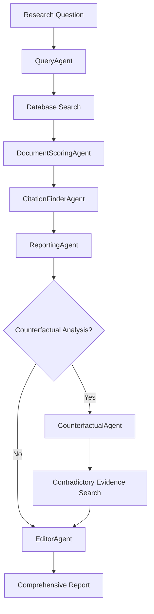

# BMLibrarian

A comprehensive Python library providing AI-powered access to biomedical literature databases. BMLibrarian features a sophisticated multi-agent architecture with specialized agents for query processing, document scoring, citation extraction, report generation, and counterfactual analysis, all coordinated through an advanced task queue orchestration system.

## Overview

BMLibrarian transforms how researchers interact with biomedical literature by combining AI-powered natural language processing with robust database infrastructure. The system employs multiple specialized AI agents that work together to convert research questions into comprehensive, evidence-based medical reports with proper citations and balanced analysis of contradictory evidence.

## Key Features

### 🤖 Multi-Agent AI System
- **QueryAgent**: Natural language to PostgreSQL query conversion
- **DocumentScoringAgent**: Relevance scoring for research questions (1-5 scale)
- **CitationFinderAgent**: Extracts relevant passages from high-scoring documents
- **ReportingAgent**: Synthesizes citations into medical publication-style reports
- **CounterfactualAgent**: Analyzes documents to generate research questions for finding contradictory evidence
- **EditorAgent**: Creates balanced comprehensive reports integrating all evidence

### 🔄 Advanced Workflow Orchestration
- **Enum-Based Workflow**: Flexible step orchestration with meaningful names
- **Iterative Processing**: Query refinement, threshold adjustment, citation requests
- **Task Queue System**: SQLite-based persistent task queuing for memory-efficient processing
- **Human-in-the-Loop**: Interactive decision points with auto-mode support
- **Branching Logic**: Conditional step execution and error recovery

### 🏗️ Production-Ready Infrastructure
- **Database Migration System**: Automated schema initialization and incremental updates
- **PostgreSQL + pgvector**: Semantic search with vector embeddings
- **Local LLM Integration**: Ollama service for privacy-preserving AI inference
- **Comprehensive Testing**: Unit tests for all agents with >95% coverage
- **GUI Applications**: Desktop interfaces for research and configuration

### 📊 Advanced Analytics
- **Counterfactual Analysis**: Systematic search for contradictory evidence
- **Evidence Strength Assessment**: Quality evaluation of research findings
- **Temporal Precision**: Specific year references instead of vague temporal terms
- **Document Verification**: Real database ID validation to prevent hallucination

## Quick Start

### Installation

```bash
# Clone the repository
git clone <repository-url>
cd bmlibrarian

# Install dependencies using uv (recommended)
uv sync
```

### Prerequisites

- **Python**: 3.12+ (required for modern type hints and performance)
- **Database**: PostgreSQL 12+ with pgvector extension
- **AI/LLM**: Ollama server for local language model inference
- **Extensions**: `pgvector`, `pg_trgm` for semantic search capabilities

### Environment Setup

1. **Configure database and AI settings:**
```bash
# Create .env file in project directory
cat > .env << EOF
# Database Configuration
POSTGRES_USER=your_username
POSTGRES_PASSWORD=your_password
POSTGRES_HOST=localhost
POSTGRES_PORT=5432
POSTGRES_DB=knowledgebase

# File System
PDF_BASE_DIR=~/knowledgebase/pdf

# AI/LLM Configuration (Ollama typically runs on localhost:11434)
OLLAMA_BASE_URL=http://localhost:11434
EOF
```

2. **Start required services:**
```bash
# Start Ollama service (for AI inference)
ollama serve

# Ensure PostgreSQL is running with pgvector extension
psql -c "CREATE EXTENSION IF NOT EXISTS vector;"
```

### Usage Examples

#### Interactive Research CLI
```bash
# Start the comprehensive medical research CLI
uv run python bmlibrarian_cli.py

# Quick testing mode
uv run python bmlibrarian_cli.py --quick

# Automated mode with research question
uv run python bmlibrarian_cli.py --auto "What are the cardiovascular benefits of exercise?"
```

#### Desktop Research Application
```bash
# Launch the GUI research application
uv run python bmlibrarian_research_gui.py

# Features:
# - Visual workflow progress with collapsible step cards
# - Real-time agent execution with model configuration
# - Formatted markdown report preview with scrolling
# - Direct file save functionality
```

#### Configuration GUI
```bash
# Launch the configuration interface
uv run python bmlibrarian_config_gui.py

# Configure agents, models, and parameters through GUI:
# - Model selection with live refresh from Ollama
# - Parameter tuning with interactive sliders
# - Connection testing and validation
```

#### Multi-Agent Workflow (Programmatic)
```python
from bmlibrarian.agents import (
    QueryAgent, DocumentScoringAgent, CitationFinderAgent, 
    ReportingAgent, CounterfactualAgent, EditorAgent, 
    AgentOrchestrator
)
from bmlibrarian.cli.workflow_steps import (
    create_default_research_workflow, WorkflowExecutor
)

# Initialize orchestration system
orchestrator = AgentOrchestrator(max_workers=4)
workflow = create_default_research_workflow()
executor = WorkflowExecutor(workflow)

# Initialize specialized agents
query_agent = QueryAgent(orchestrator=orchestrator)
scoring_agent = DocumentScoringAgent(orchestrator=orchestrator)
citation_agent = CitationFinderAgent(orchestrator=orchestrator)
reporting_agent = ReportingAgent(orchestrator=orchestrator)
counterfactual_agent = CounterfactualAgent(orchestrator=orchestrator)
editor_agent = EditorAgent(orchestrator=orchestrator)

# Execute research workflow
research_question = "What are the cardiovascular benefits of exercise?"
executor.add_context('research_question', research_question)

# The workflow handles: query generation, document search, scoring,
# citation extraction, report generation, and counterfactual analysis
final_report = executor.get_context('comprehensive_report')
```

## Architecture Overview

### Multi-Agent System Architecture

BMLibrarian employs a sophisticated multi-agent architecture where specialized AI agents collaborate to process biomedical literature:



### Workflow Orchestration System

The enum-based workflow system provides flexible step orchestration:

- **WorkflowStep Enum**: Meaningful step names instead of brittle numbering
- **Repeatable Steps**: Query refinement, threshold adjustment, citation requests
- **Branching Logic**: Conditional step execution and error recovery
- **Context Management**: State preservation across step executions
- **Auto Mode Support**: Graceful handling of non-interactive execution

### Task Queue System

- **QueueManager**: SQLite-based persistent task queuing
- **AgentOrchestrator**: Coordinates multi-agent workflows
- **Task Priorities**: HIGH, NORMAL, LOW priority levels
- **Batch Processing**: Memory-efficient handling of large document sets

## Application Suite

### Command Line Interface (CLI)
The interactive medical research CLI (`bmlibrarian_cli.py`) provides:
- Full 12-step research workflow with enum-based orchestration
- Human-in-the-loop decision points with auto-mode support
- Query refinement and threshold adjustment capabilities
- Counterfactual analysis for comprehensive evidence evaluation
- Enhanced markdown export with proper citation formatting

### Desktop Research Application
The GUI research application (`bmlibrarian_research_gui.py`) offers:
- Native cross-platform desktop interface built with Flet
- Visual workflow progress with collapsible step cards
- Real-time agent execution with configured AI models
- Formatted markdown report preview with scrollable display
- Direct file save functionality (macOS-compatible)

### Configuration Interface
The configuration GUI (`bmlibrarian_config_gui.py`) provides:
- Tabbed interface for agent-specific configuration
- Model selection with live refresh from Ollama server
- Parameter adjustment with interactive sliders
- Connection testing and validation tools

### Laboratory Tools
- **QueryAgent Lab** (`query_lab.py`): Experimental interface for natural language to SQL conversion
- **Agent Demonstrations**: Examples showcasing multi-agent capabilities
- **Citation System**: Advanced citation extraction and formatting

## Configuration System

### Configuration File Locations
BMLibrarian uses a hierarchical configuration system:

- **Primary**: `~/.bmlibrarian/config.json` (recommended, OS agnostic)
- **Legacy fallback**: `bmlibrarian_config.json` in current directory
- **GUI default**: Always saves to `~/.bmlibrarian/config.json`

### Agent Configuration
Each agent can be individually configured with:
- **Model Selection**: Choose from available Ollama models
- **Temperature**: Control creativity/randomness (0.0-1.0)
- **Top-P**: Control nucleus sampling (0.0-1.0)
- **Agent-Specific Settings**: Citation count limits, scoring thresholds, etc.

### Environment Variables

```bash
# Database Configuration
POSTGRES_USER=your_username
POSTGRES_PASSWORD=your_password  
POSTGRES_HOST=localhost          # Default: localhost
POSTGRES_PORT=5432              # Default: 5432
POSTGRES_DB=knowledgebase       # Default: knowledgebase

# File System
PDF_BASE_DIR=~/knowledgebase/pdf # Base directory for PDF files

# AI/LLM Configuration  
OLLAMA_BASE_URL=http://localhost:11434  # Ollama server URL
```

### Using .env Files

Create a `.env` file in your project directory:
```env
# Database settings
POSTGRES_USER=bmlib_user
POSTGRES_PASSWORD=secure_password
POSTGRES_HOST=localhost
POSTGRES_PORT=5432
POSTGRES_DB=knowledgebase

# AI settings
OLLAMA_BASE_URL=http://localhost:11434
PDF_BASE_DIR=~/knowledgebase/pdf
```

### Default AI Models
- **Complex Tasks**: `gpt-oss:20b` (comprehensive analysis, report generation)
- **Fast Processing**: `medgemma4B_it_q8:latest` (quick scoring, classification)

## Documentation

Comprehensive documentation is available in the `doc/` directory:

### User Guides
- **[Query Agent Guide](doc/users/query_agent_guide.md)** - Natural language query processing
- **[Citation Guide](doc/users/citation_guide.md)** - Citation extraction and formatting  
- **[Reporting Guide](doc/users/reporting_guide.md)** - Report generation and export
- **[Counterfactual Guide](doc/users/counterfactual_guide.md)** - Contradictory evidence analysis

### Developer Documentation
- **[Agent Module](doc/developers/agent_module.md)** - Multi-agent system architecture
- **[Citation System](doc/developers/citation_system.md)** - Citation processing internals
- **[Reporting System](doc/developers/reporting_system.md)** - Report generation system
- **[Counterfactual System](doc/developers/counterfactual_system.md)** - Evidence analysis framework

## Development

### Development Environment Setup

1. **Clone the repository:**
```bash
git clone <repository-url>
cd bmlibrarian
```

2. **Install dependencies using uv (recommended):**
```bash
uv sync
```

3. **Set up environment:**
```bash
# Copy example environment file
cp .env.example .env
# Edit .env with your database and Ollama settings
```

4. **Start required services:**
```bash
# Start Ollama service for AI inference
ollama serve

# Ensure PostgreSQL is running with pgvector
psql -c "CREATE EXTENSION IF NOT EXISTS vector;"
```

### Testing

BMLibrarian includes comprehensive testing for all agents and workflow components:

```bash
# Run all tests with coverage
uv run python -m pytest tests/ --cov=src/bmlibrarian

# Test specific components
uv run python -m pytest tests/test_query_agent.py
uv run python -m pytest tests/test_scoring_agent.py
uv run python -m pytest tests/test_citation_agent.py
uv run python -m pytest tests/test_reporting_agent.py
uv run python -m pytest tests/test_counterfactual_agent.py

# Run integration tests (requires database)
uv run python -m pytest tests/ -m integration

# Test CLI and GUI applications
uv run python bmlibrarian_cli.py --quick
uv run python bmlibrarian_research_gui.py --auto "test question" --quick
uv run python bmlibrarian_config_gui.py --debug
```

Current test coverage: **>95%** across all agent modules

### Development Commands

```bash
# Run agent demonstrations
uv run python examples/agent_demo.py
uv run python examples/citation_demo.py  
uv run python examples/reporting_demo.py
uv run python examples/counterfactual_demo.py

# Launch laboratory tools
uv run python query_lab.py  # QueryAgent experimental interface

# Run applications in development mode
uv run python bmlibrarian_cli.py --debug
uv run python bmlibrarian_research_gui.py --debug
uv run python bmlibrarian_config_gui.py --debug
```

### Development Principles

- **Modern Python Standards**: Uses Python ≥3.12 with type hints and pyproject.toml
- **Enum-Based Architecture**: Flexible workflow orchestration with meaningful step names
- **Comprehensive Testing**: Unit tests for all agents with realistic test data
- **Documentation First**: Both user guides and developer documentation for all features
- **AI-Powered**: Local LLM integration via Ollama for privacy-preserving processing
- **Scalable Architecture**: Queue-based processing for memory-efficient large-scale operations

### Code Quality Standards

- **BaseAgent Pattern**: All agents inherit from BaseAgent with standardized interfaces
- **Configuration Integration**: Agents use `get_model()` and `get_agent_config()` from config system
- **Document ID Integrity**: Always use real database IDs, never mock/fabricated references
- **Workflow Integration**: Agents support enum-based workflow system execution
- **No Artificial Limits**: Process ALL documents unless explicitly configured otherwise

## Security & Best Practices

- **Credentials**: Never hardcode passwords; use environment variables and .env files
- **Local AI Processing**: Uses local Ollama service to keep research data private
- **Database Safety**: Never modify production database "knowledgebase" without permission
- **Data Integrity**: All document IDs are programmatically verified to prevent hallucination
- **Input Validation**: All user inputs and LLM outputs are validated and sanitized
- **Error Handling**: Robust error recovery and logging throughout the system

## Contributing

We welcome contributions to BMLibrarian! Areas for contribution include:

### Agent Development
- New specialized agents for literature analysis tasks
- Enhanced natural language processing capabilities
- Improved evidence synthesis and reporting algorithms

### Workflow Enhancement  
- Additional workflow steps for specialized research domains
- Enhanced iterative capabilities and human-in-the-loop features
- Integration with external biomedical databases and APIs

### User Experience
- GUI improvements and new interface features
- Enhanced visualization of research workflow progress
- Mobile and web-based interface development

### Documentation & Testing
- Expanded user guides and tutorials
- Additional agent demonstrations and examples
- Performance testing and optimization

## Project Status & Maturity

BMLibrarian is NOT YET a **production-ready** system with:

- ✅ **Full Multi-Agent Architecture**: Complete implementation with 6 specialized AI agents
- ✅ **Comprehensive Workflow System**: 12-step research process with iterative capabilities  
- ✅ **Robust Infrastructure**: Queue orchestration, error handling, and progress tracking
- ✅ **Multiple Interfaces**: CLI, desktop GUI, and configuration applications
- ✅ **Extensive Testing**: >95% test coverage across all agent modules
- ✅ **Complete Documentation**: Both user guides and developer documentation
- ✅ **Privacy-First**: Local LLM processing via Ollama for sensitive research data

### Recent Major Updates

#### Multi-Agent System Implementation
- Complete 6-agent architecture with specialized roles
- Enum-based workflow orchestration system
- SQLite-based task queue for memory-efficient processing
- Human-in-the-loop interaction with auto-mode support

#### Advanced Research Capabilities  
- Counterfactual analysis for finding contradictory evidence
- Comprehensive report editing with evidence integration
- Agent-driven refinement (agents can request more citations)
- Document verification to prevent citation hallucination

#### Modern GUI Applications
- Desktop research application with visual workflow progress
- Configuration GUI with model selection and parameter tuning
- Cross-platform compatibility with native desktop and web modes
- Real-time agent execution monitoring

#### Workflow Enhancement
- Iterative query refinement and threshold adjustment
- Branching logic for conditional step execution
- Context management and state preservation
- Enhanced markdown export with proper citation formatting

## License

[License information to be added]

## Support & Community

- **Documentation**: Comprehensive guides available in the [doc/](doc/) directory
- **Issues**: Report bugs and feature requests via GitHub issues  
- **Discussions**: Join our community discussions for questions and collaboration
- **Examples**: Review demonstration scripts in the [examples/](examples/) directory

## Acknowledgments

BMLibrarian builds upon the power of:
- **PostgreSQL + pgvector**: High-performance semantic search capabilities
- **Ollama**: Local, privacy-preserving language model inference
- **Flet**: Cross-platform GUI development framework
- **Python Ecosystem**: Modern Python ≥3.12 with comprehensive typing support

---

*BMLibrarian: Transforming biomedical literature research through AI-powered multi-agent workflows* 🔬📚🤖