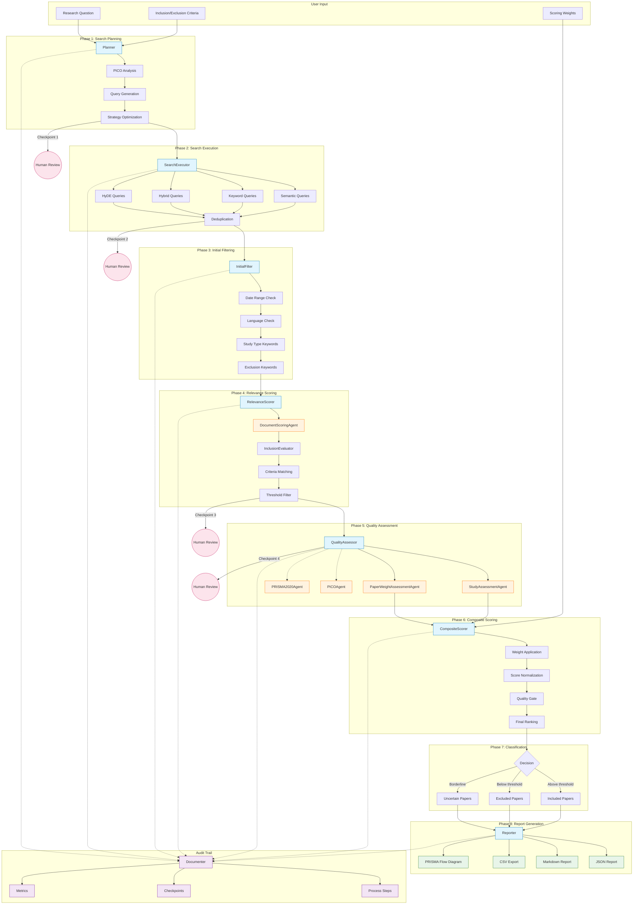
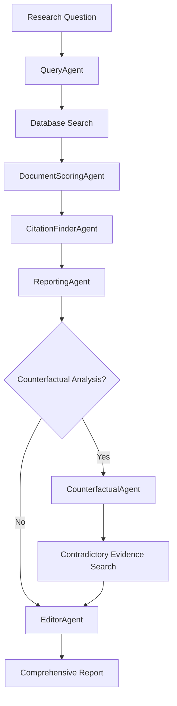

# BMLibrarian

**The Biomedical Researcher's AI Workbench**

BMLibrarian is a comprehensive AI-powered platform designed to be a complete workbench for biomedical researchers, clinicians, and systematic reviewers. It provides evidence-based answers to clinical questions, peer-review quality automated assessment of research papers, and systematic fact-checking of biomedical statements—all powered by local AI models requiring no cloud APIs or external services.

## Why BMLibrarian?

### Evidence-Based Answers to Clinical Questions

Ask questions like *"What are the cardiovascular benefits of exercise?"* or *"Does metformin reduce mortality in diabetic patients?"* and receive comprehensive, citation-backed reports synthesizing evidence from the latest biomedical literature.

### Automated Research Quality Assessment

Evaluate research papers with the rigor of peer review:
- **Paper Weight Assessment**: Evaluate the evidential weight of studies based on study design, sample size, methodological quality, and risk of bias
- **PRISMA 2020 Compliance**: Assess systematic reviews against the 27-item PRISMA 2020 checklist
- **PICO Extraction**: Automatically extract Population, Intervention, Comparison, and Outcome components for systematic reviews

### Robust Fact-Checking

Validate biomedical statements with literature evidence:
- **Statement Fact-Checker**: Evaluate claims like *"Vaccine X causes Y"* against published literature
- **PaperChecker**: Validate research abstract claims by systematically searching for contradictory evidence
- **Counterfactual Analysis**: Actively search for evidence that contradicts initial findings for balanced conclusions

### Works Offline—Critical for Global Health

BMLibrarian is designed for clinicians and researchers working in areas with limited or unreliable internet connectivity:

- **Runs entirely with local AI models** via Ollama—no cloud APIs required
- **Local database** of PubMed and medRxiv publications with full-text PDFs where available
- **No API keys, subscriptions, or external services needed**
- **Periodic synchronization** with PubMed and medRxiv when connected
- **Complete functionality offline** after initial data import

This makes BMLibrarian uniquely valuable for healthcare workers in remote regions, field hospitals, developing nations, or any environment where reliable internet cannot be guaranteed.

### Multiple Search Strategies with AI Assistance

BMLibrarian employs sophisticated multi-strategy search capabilities:
- **Multi-model query generation**: Use multiple AI models to generate diverse database queries
- **Semantic search**: Vector-based similarity search using document embeddings
- **HyDE (Hypothetical Document Embeddings)**: Generate hypothetical answers to improve search relevance
- **Keyword extraction**: Traditional keyword-based search as fallback
- **Counterfactual search**: Actively search for contradictory evidence

### Privacy-Preserving AI

All AI processing happens locally on your hardware:
- **No data leaves your machine**—perfect for sensitive patient data or pre-publication research
- **No usage tracking or telemetry**
- **Complete control over model selection and parameters**

## What's New 🎉

**Latest Features (11/2025):**

### 🔬 Systematic Literature Review Agent

A complete systematic review automation system with human oversight and audit trails. Conducts AI-assisted literature reviews following PRISMA 2020 guidelines with configurable search strategies, quality assessment, and composite scoring.

```bash
# Run a systematic review
python systematic_review_cli.py --question "Effect of statins on CVD prevention" \
    --include "RCTs" "Human studies" --exclude "Animal studies"
```

**Key Capabilities:**
- **Multi-strategy search**: Semantic, keyword, hybrid, and HyDE queries with PICO analysis
- **8-phase workflow**: Search planning → Execution → Filtering → Scoring → Quality → Composite → Classification → Reporting
- **Human checkpoints**: Interactive mode pauses at key decision points for human review
- **Quality assessment**: Integrates StudyAssessmentAgent, PaperWeightAssessmentAgent, PICOAgent, and PRISMA2020Agent
- **Complete audit trail**: Full reproducibility with JSON, Markdown, CSV, and PRISMA flow diagram outputs
- **Configurable weights**: Customize relevance, quality, recency, and source reliability weights

#### Systematic Review Workflow Diagram



### ✅ Audit Trail Validation GUI

A human review interface for validating automated evaluations in the systematic review audit trail. Enables benchmarking AI accuracy and collecting training data for model improvement.

```bash
# Launch audit validation GUI
uv run python audit_validation_gui.py --user alice

# Incremental mode (show only unvalidated items)
uv run python audit_validation_gui.py --user alice --incremental
```

**Key Features:**
- **Tab-per-step organization**: Separate tabs for Queries, Scores, Citations, Reports, and Counterfactuals
- **Validation statuses**: Mark items as Validated, Incorrect, Uncertain, or Needs Review
- **Error categorization**: 25+ predefined error categories organized by target type
- **Statistics dashboard**: Track validation rates, error distributions, and reviewer performance
- **Multi-reviewer support**: Enable inter-rater reliability studies with per-reviewer tracking
- **Time tracking**: Monitor review time per item for benchmarking

### ✍️ Citation-Aware Writing Editor

A markdown editor with integrated citation management for academic writing. Search and cite references from your literature database while writing manuscripts and systematic review reports.

**Key Features:**
- **Citation markers**: Insert citations with `[@id:12345:Smith2023]` format
- **Semantic search**: Find references using natural language queries
- **Multiple styles**: Vancouver, APA, Harvard, and Chicago citation formats
- **Autosave with history**: Automatic saves with version history
- **Export with references**: Generate formatted documents with proper reference lists
- **Database persistence**: Documents stored in PostgreSQL for reliable storage

### Other Recent Features

- 📊 **Paper Weight Assessment**: Evaluate research papers across five quality dimensions (study design, sample size, methodology, bias risk, replication)
- 🔬 **PICO Extraction**: Automatically extract Population, Intervention, Comparison, and Outcome for systematic reviews
- ✅ **PRISMA 2020 Compliance**: Assess systematic reviews against the full 27-item PRISMA 2020 checklist
- 📖 **Document Interrogation**: Interactive Q&A interface for asking questions about loaded PDF, Markdown, or text documents
- 🔗 **Full-Text PDF Discovery**: Automated discovery and download from PMC, Unpaywall, DOI resolution, and OpenAthens
- 🔍 **PaperChecker System**: Fact-check medical abstracts by searching for contradictory literature evidence
- 🔍 **Fact Checker System**: LLM training data auditing with literature validation
  - **CLI & Desktop GUI**: Batch processing and interactive human review interfaces
  - **Blind Mode**: Review statements without AI bias for unbiased human annotation
  - **Incremental Mode**: Smart filtering to show only unannotated statements
  - **SQLite Integration**: Persistent database storage with intelligent JSON import/merge
- 🚀 **Multi-Model Query Generation**: Use up to 3 AI models simultaneously for 20-40% more relevant documents
- 📊 **Query Performance Tracking**: Real-time analysis showing which models find the best documents
- 🗄️ **PostgreSQL Audit Trail**: Complete persistent tracking of research workflow sessions
- ⚡ **Automatic Database Migrations**: Zero-configuration schema updates on startup

## Overview

BMLibrarian transforms how researchers interact with biomedical literature by combining AI-powered natural language processing with robust database infrastructure. The system employs multiple specialized AI agents that work together to convert research questions into comprehensive, evidence-based medical reports with proper citations and balanced analysis of contradictory evidence.

## ARCHITECTURAL SCALE

### Codebase Statistics

- **347 Python files** organized in hierarchical module structure
- **437 classes** implementing specialized functionality
- **3,654 functions** providing granular capabilities
- **104,000 lines of code** (excluding comments, docstrings, and blank lines)
- **> 8,000 lines of docstrings** for comprehensive documentation
- **100% type hints** for all public APIs and data structures
- **100% docstrings** for all public APIs, classes, methods, and functions
- **Comprehensive test coverage:** >95% across critical modules

### Comparison to Established Systems

| System | Lines of Code | Domain | Status |
|--------|---------------|--------|--------|
| Redis | ~30,000 | Database | Production |
| nginx | ~100,000 | Web server | Production |
| **BMLibrarian** | **~104,000** | **Biomedical AI** | **functional prototype** |
| Django | ~300,000 | Web framework | Production |

**BMLibrarian is comparable in scale to mature, widely-deployed infrastructure software.**

---

## WHAT THIS SCALE REPRESENTS

### Not a PhD Side Project — Infrastructure Software

**Multi-layer architecture:**
- **Core database layer:** PostgreSQL integration with custom query optimization
- **Vector search layer:** pgvector integration with HNSW indexing at 40M document scale
- **Agent orchestration layer:** 13+ specialized AI agents with sophisticated coordination
- **Workflow management layer:** Persistent task queuing, state management, error recovery
- **Multiple user interfaces:** CLI, desktop GUI (Flet + Qt), web mode, laboratory tools
- **Full-text discovery system:** Multi-source PDF retrieval with browser automation
- **Research quality assessment:** PRISMA 2020, PICO extraction, study design evaluation
- **Fact-checking infrastructure:** Statement validation, training data auditing
- **Configuration management:** Hierarchical config system with GUI editors
- **Database migrations:** Automatic schema updates with version tracking
- **Comprehensive documentation:** User guides + developer docs for every major component

### Development Methodology

**Professional software engineering practices:**
- ✅ Type hints throughout (Python 3.12+)
- ✅ Comprehensive unit testing (>95% coverage)
- ✅ Modular architecture with clear separation of concerns
- ✅ Configuration-driven design (no hardcoded parameters)
- ✅ Extensive error handling and logging
- ✅ Database transaction management and connection pooling
- ✅ Async/parallel processing where appropriate
- ✅ GUI/CLI separation for testability
- ✅ Plugin architecture for extensibility
---

## Fact Checker System 🔍

The **BMLibrarian Fact Checker** is a specialized tool for auditing biomedical statements in LLM training datasets, medical knowledge bases, and research claims. It evaluates statement veracity by searching literature databases and comparing claims against published evidence.

### Core Capabilities

- **Automated Verification**: Evaluates biomedical statements as yes/no/maybe based on literature evidence
- **Evidence Extraction**: Provides specific citations with stance indicators (supports/contradicts/neutral)
- **Batch Processing**: Process hundreds of statements from JSON input files
- **Confidence Assessment**: Rates confidence (high/medium/low) based on evidence strength and consistency
- **Citation Validation**: Prevents hallucination by validating all citations reference real database documents
- **Human Review Interface**: Desktop GUI for annotation, comparison, and quality control

### Key Features

#### CLI Tool (`fact_checker_cli.py`)
- **Batch fact-checking** from JSON input files
- **Incremental processing** - smart detection of previously evaluated statements
- **SQLite database storage** for persistent results and annotations
- **Flexible thresholds** for relevance scoring and citation extraction
- **Quick mode** for faster testing with reduced document sets
- **Detailed output** with evidence metadata and validation statistics

#### Review GUI (`fact_checker_review_gui.py`)
- **Interactive human review** with statement-by-statement navigation
- **Blind mode** - hide AI evaluations to prevent bias during human annotation
- **Incremental mode** - filter to show only unannotated statements for efficient review
- **Database integration** - automatic SQLite database creation from JSON files
- **Intelligent merging** - import new statements without overwriting existing annotations
- **Citation inspection** - expandable cards with full abstracts and highlighted passages
- **Multi-user support** - track annotations by different reviewers
- **Export functionality** - save human-annotated results for analysis

### Use Cases

1. **LLM Training Data Auditing**: Verify factual accuracy of biomedical statements in training datasets
2. **Medical Knowledge Validation**: Check medical claims against current literature
3. **Dataset Quality Control**: Identify potentially incorrect statements in medical corpora
4. **Evidence-Based Verification**: Validate medical facts with specific literature references
5. **Research Claim Verification**: Evaluate research statements before publication

### Database Workflow

The fact checker uses SQLite databases for persistent storage:

1. **First run with JSON**: Creates `.db` file alongside input JSON (e.g., `results.json` → `results.db`)
2. **Subsequent runs**: Intelligently merges new statements from JSON without overwriting existing evaluations/annotations
3. **Real-time persistence**: All AI evaluations and human annotations saved immediately to database
4. **Incremental processing**: Skip already-evaluated statements with `--incremental` flag
5. **Cross-tool compatibility**: CLI and GUI share the same database format

### Example Workflow

```bash
# Step 1: Generate fact-check results from statements
uv run python fact_checker_cli.py statements.json -o results.json
# Creates: results.json (JSON output) and results.db (SQLite database)

# Step 2: Review with GUI in blind mode (no AI bias)
uv run python fact_checker_review_gui.py --input-file results.db --blind --user alice
# Human reviewer annotates statements without seeing AI evaluations

# Step 3: Review remaining statements in normal mode
uv run python fact_checker_review_gui.py --input-file results.db --incremental --user alice
# Shows only statements not yet annotated by alice

# Step 4: Export annotated results
# Use GUI "Save Reviews" button → results_annotated.json

# Step 5: Analyze results
uv run python analyze_factcheck_progress.py results_annotated.json
```

## PaperChecker System

The **BMLibrarian PaperChecker** is a sophisticated fact-checking system for medical abstracts that validates research claims by systematically searching for and analyzing contradictory evidence.

### Core Capabilities

- **Statement Extraction**: Identifies core research claims (hypothesis, finding, conclusion) from abstracts
- **Counter-Evidence Search**: Multi-strategy search (semantic + HyDE + keyword) for contradictory literature
- **Evidence-Based Verdicts**: Three-class classification (supports/contradicts/undecided) with confidence levels
- **Complete Audit Trail**: Full provenance tracking from search to final verdict
- **Batch Processing**: CLI for processing multiple abstracts with database persistence

### Key Features

#### CLI Tool (`paper_checker_cli.py`)
- **Batch fact-checking** of medical abstracts from JSON or by PMID
- **Multi-strategy search** combining semantic, HyDE, and keyword approaches
- **Counter-report generation** synthesizing contradictory evidence
- **Markdown export** for detailed reports per abstract
- **Database persistence** in PostgreSQL `papercheck` schema

#### Laboratory GUI (`paper_checker_lab.py`)
- **Interactive testing** with step-by-step workflow visualization
- **Real-time progress** showing each processing stage
- **Results inspection** for all intermediate outputs
- **Desktop and web modes** for flexible deployment

### Workflow Overview

```
Abstract → Statement Extraction → Counter-Statement Generation →
Multi-Strategy Search → Document Scoring → Citation Extraction →
Counter-Report Generation → Verdict Analysis → JSON/Markdown Output
```

### Example Usage

```bash
# Check abstracts from JSON file
uv run python paper_checker_cli.py abstracts.json -o results.json

# Export detailed markdown reports
uv run python paper_checker_cli.py abstracts.json --export-markdown reports/

# Check abstracts by PMID from database
uv run python paper_checker_cli.py --pmid 12345678 23456789

# Quick mode for testing
uv run python paper_checker_cli.py abstracts.json --quick

# Interactive laboratory
uv run python paper_checker_lab.py
```

### Documentation

- [User Guide](doc/users/paper_checker_guide.md) - Overview and quick start
- [CLI Guide](doc/users/paper_checker_cli_guide.md) - Command-line reference
- [Laboratory Guide](doc/users/paper_checker_lab_guide.md) - Interactive testing
- [Architecture](doc/developers/paper_checker_architecture.md) - System design

## Paper Weight Assessment

The **Paper Weight Assessment** system evaluates the evidential strength of biomedical research papers based on multiple dimensions, providing a comprehensive quality score that helps researchers and clinicians assess how much weight to give to study findings.

### Assessment Dimensions

| Dimension | Weight | What It Evaluates |
|-----------|--------|-------------------|
| **Study Design** | 25% | Research methodology (RCT, cohort, case-control, etc.) |
| **Sample Size** | 15% | Statistical power, confidence intervals, power calculations |
| **Methodological Quality** | 30% | Randomization, blinding, protocol registration, ITT analysis |
| **Risk of Bias** | 20% | Selection, performance, detection, and reporting biases |
| **Replication Status** | 10% | Whether findings have been replicated by other studies |

### Example Usage

```bash
# Launch the Paper Weight Laboratory (GUI)
uv run python paper_weight_lab.py

# Features:
# - Search documents by PMID, DOI, or title
# - Real-time assessment progress tracking
# - Detailed audit trail for each dimension
# - Configurable dimension weights
# - Export to Markdown or JSON
```

### Documentation

- [User Guide](doc/users/paper_weight_lab_guide.md) - Complete laboratory guide

## PICO Extraction System

The **PICO Agent** extracts structured components from biomedical research papers using the PICO framework—essential for systematic reviews and evidence-based medicine.

### What is PICO?

- **P**opulation: Who was studied? (demographics, condition, setting)
- **I**ntervention: What was done? (treatment, test, exposure)
- **C**omparison: What was the control? (placebo, alternative treatment)
- **O**utcome: What was measured? (effects, results, endpoints)

### Example Usage

```python
from bmlibrarian.agents import PICOAgent

agent = PICOAgent(model="gpt-oss:20b")
extraction = agent.extract_pico_from_document(document)

print(f"Population: {extraction.population}")
print(f"Intervention: {extraction.intervention}")
print(f"Comparison: {extraction.comparison}")
print(f"Outcome: {extraction.outcome}")
print(f"Confidence: {extraction.extraction_confidence:.1%}")
```

```bash
# Interactive PICO Laboratory
uv run python pico_lab.py

# Batch process documents
# Export to CSV for systematic review tools (Covidence, DistillerSR)
```

### Use Cases

- **Systematic Reviews**: Rapidly extract PICO from hundreds of papers
- **Meta-Analysis**: Standardize study data for quantitative synthesis
- **Research Gap Analysis**: Identify understudied populations or outcomes
- **Grant Writing**: Structure research questions using evidence-based frameworks

### Documentation

- [User Guide](doc/users/pico_agent_guide.md) - Complete PICO extraction guide
- [Developer Documentation](doc/developers/pico_agent.md) - API reference

## PRISMA 2020 Compliance Assessment

The **PRISMA 2020 Agent** assesses systematic reviews and meta-analyses against the PRISMA 2020 (Preferred Reporting Items for Systematic reviews and Meta-Analyses) 27-item checklist.

### Assessment Process

1. **Suitability Check**: Automatically determines if the document is a systematic review or meta-analysis
2. **27-Item Assessment**: Evaluates all PRISMA checklist items with detailed explanations
3. **Compliance Scoring**: Provides overall compliance percentage and category

### Scoring System

| Score | Category | Interpretation |
|-------|----------|----------------|
| 90-100% | Excellent | Outstanding adherence to PRISMA 2020 |
| 75-89% | Good | Strong reporting with minor gaps |
| 60-74% | Adequate | Acceptable with room for improvement |
| 40-59% | Poor | Significant reporting deficiencies |
| 0-39% | Very Poor | Major reporting failures |

### Example Usage

```bash
# Launch the PRISMA 2020 Laboratory (GUI)
uv run python prisma2020_lab.py

# Features:
# - Automatic suitability screening
# - Color-coded compliance cards for each item
# - Export assessments to JSON or CSV
# - Batch processing multiple reviews
```

### Use Cases

- **Self-assessment** before submitting systematic reviews to journals
- **Peer review** of systematic review manuscripts
- **Editorial screening** for journal submissions
- **Training** on PRISMA 2020 standards

### Documentation

- [User Guide](doc/users/prisma2020_guide.md) - Complete assessment guide
- [Developer Documentation](doc/developers/prisma2020_system.md) - System architecture

## Document Interrogation

The **Document Interrogation** interface provides an interactive chat experience for asking questions about loaded documents (PDFs, Markdown, or text files).

### Features

- **Split-pane interface**: Document viewer (60%) and chat interface (40%)
- **Multiple document formats**: PDF, Markdown (.md), text (.txt)
- **Dialogue-style chat**: User and AI messages in distinct bubbles
- **Full conversation history**: Scrollable message history
- **Model selection**: Choose any available Ollama model

### Example Usage

```bash
# Launch the Configuration GUI (includes Document Interrogation tab)
uv run python bmlibrarian_config_gui.py

# Workflow:
# 1. Navigate to "Document Interrogation" tab
# 2. Load a document (PDF, MD, or TXT)
# 3. Select an Ollama model
# 4. Ask questions about the document
```

### Example Questions

- *"What are the main findings of this study?"*
- *"What methods did the authors use?"*
- *"Are there any limitations mentioned?"*
- *"Summarize the introduction section"*

### Documentation

- [User Guide](doc/users/document_interrogation_guide.md) - Complete usage guide

## Full-Text PDF Discovery

The **Full-Text Discovery** system automatically finds and downloads PDF versions of academic papers through legal open access channels.

### Discovery Sources (in priority order)

1. **PubMed Central (PMC)** - Verified open access repository
2. **Unpaywall** - Open access aggregator (millions of papers)
3. **DOI Resolution** - CrossRef and doi.org content negotiation
4. **Direct URL** - Existing PDF URLs from database
5. **OpenAthens** - Institutional proxy (if configured)

### Example Usage

```python
from bmlibrarian.discovery import FullTextFinder, DocumentIdentifiers

# Create finder with Unpaywall email
finder = FullTextFinder(unpaywall_email="your@email.com")

# Discover PDF sources
identifiers = DocumentIdentifiers(doi="10.1038/nature12373")
result = finder.discover(identifiers)

if result.best_source:
    print(f"Found: {result.best_source.url}")
    print(f"Access: {result.best_source.access_type.value}")
```

```bash
# Download PDFs for documents in database
uv run python -c "from bmlibrarian.discovery import download_pdf_for_document; ..."
```

### Key Features

- **Multi-source discovery**: Searches PMC, Unpaywall, CrossRef, DOI.org
- **Priority-based selection**: Automatically selects best source (open access preferred)
- **Browser fallback**: Handles Cloudflare and anti-bot protections via Playwright
- **Year-based organization**: PDFs stored in `YYYY/filename.pdf` structure
- **Database integration**: Automatically updates document records with PDF paths

### Documentation

- [User Guide](doc/users/full_text_discovery_guide.md) - Complete discovery guide
- [Developer Documentation](doc/developers/full_text_discovery_system.md) - System architecture

## Key Features

### 🤖 Multi-Agent AI System
- **QueryAgent**: Natural language to PostgreSQL query conversion
- **DocumentScoringAgent**: Relevance scoring for research questions (1-5 scale)
- **CitationFinderAgent**: Extracts relevant passages from high-scoring documents
- **ReportingAgent**: Synthesizes citations into medical publication-style reports
- **CounterfactualAgent**: Analyzes documents to generate research questions for finding contradictory evidence
- **EditorAgent**: Creates balanced comprehensive reports integrating all evidence
- **FactCheckerAgent**: Evaluates biomedical statements (yes/no/maybe) with literature evidence for training data auditing
- **PaperCheckerAgent**: Validates medical abstract claims against contradictory literature evidence
- **PICOAgent**: Extracts Population, Intervention, Comparison, and Outcome components from research papers
- **PRISMA2020Agent**: Assesses systematic reviews against the 27-item PRISMA 2020 checklist
- **StudyAssessmentAgent**: Evaluates research quality, study design, methodological rigor, and bias risk
- **PaperWeightAgent**: Comprehensive evidential weight scoring across five quality dimensions
- **DocumentInterrogationAgent**: Interactive Q&A with loaded documents (PDF, Markdown, text)

### 🔄 Advanced Workflow Orchestration
- **Enum-Based Workflow**: Flexible step orchestration with meaningful names
- **Iterative Processing**: Query refinement, threshold adjustment, citation requests
- **Task Queue System**: SQLite-based persistent task queuing for memory-efficient processing
- **Human-in-the-Loop**: Interactive decision points with auto-mode support
- **Branching Logic**: Conditional step execution and error recovery

### 🏗️ Production-Ready Infrastructure
- **Database Migration System**: Automated schema initialization and incremental updates with startup integration
- **PostgreSQL + pgvector**: Semantic search with vector embeddings
- **PostgreSQL Audit Trail**: Comprehensive tracking of research workflow sessions, queries, documents, and evaluations
- **Local LLM Integration**: Ollama service for privacy-preserving AI inference
- **Comprehensive Testing**: Unit tests for all agents with >95% coverage
- **GUI Applications**: Desktop interfaces for research and configuration
- **Browser-Based Downloader**: Playwright automation for Cloudflare-protected PDFs (optional)

### 📊 Advanced Analytics
- **Multi-Model Query Generation**: Use multiple AI models (up to 3) to generate diverse database queries for 20-40% improved document retrieval
- **Query Performance Tracking**: Real-time analysis of which models and parameters find the most relevant documents
- **Counterfactual Analysis**: Systematic search for contradictory evidence with progressive audit trail
- **Evidence Strength Assessment**: Quality evaluation with citation validation and rejection reasoning
- **Temporal Precision**: Specific year references instead of vague temporal terms
- **Document Verification**: Real database ID validation to prevent hallucination
- **Citation Validation**: AI-powered verification that citations actually support counterfactual claims
- **User Override Capability**: Expert users can override AI rejection decisions with custom reasoning
- **Research Workflow Audit Trail**: PostgreSQL-based persistent tracking of complete research sessions

## Quick Start

### Installation

```bash
# Clone the repository
git clone <repository-url>
cd bmlibrarian

# Install dependencies using uv (recommended)
uv sync
```

### Prerequisites

- **Python**: 3.12+ (required for modern type hints and performance)
- **Database**: PostgreSQL 12+ with pgvector extension
- **AI/LLM**: Ollama server for local language model inference
- **Extensions**: `pgvector`, `pg_trgm` for semantic search capabilities

### Environment Setup

1. **Configure database and AI settings:**
```bash
# Create .env file in project directory
cat > .env << EOF
# Database Configuration
POSTGRES_USER=your_username
POSTGRES_PASSWORD=your_password
POSTGRES_HOST=localhost
POSTGRES_PORT=5432
POSTGRES_DB=knowledgebase

# File System
PDF_BASE_DIR=~/knowledgebase/pdf

# AI/LLM Configuration (Ollama typically runs on localhost:11434)
OLLAMA_BASE_URL=http://localhost:11434
EOF
```

2. **Start required services:**
```bash
# Start Ollama service (for AI inference)
ollama serve

# Ensure PostgreSQL is running with pgvector extension
psql -c "CREATE EXTENSION IF NOT EXISTS vector;"
```

### Usage Examples

#### Interactive Research CLI
```bash
# Start the comprehensive medical research CLI
uv run python bmlibrarian_cli.py

# Quick testing mode
uv run python bmlibrarian_cli.py --quick

# Automated mode with research question
uv run python bmlibrarian_cli.py --auto "What are the cardiovascular benefits of exercise?"
```

#### Desktop Research Application
```bash
# Launch the GUI research application
uv run python bmlibrarian_research_gui.py

# Features:
# - Visual workflow progress with collapsible step cards
# - Real-time agent execution with model configuration
# - Multi-model query generation with smart pagination and result tracking
# - Query performance statistics showing model effectiveness
# - Progressive counterfactual audit trail showing claims, queries, searches, and results
# - Formatted markdown report preview with scrolling
# - Direct file save functionality
# - Complete transparency into citation validation and rejection reasoning
# - Automatic audit trail persistence to PostgreSQL database
```

#### Configuration GUI
```bash
# Launch the configuration interface
uv run python bmlibrarian_config_gui.py

# Configure agents, models, and parameters through GUI:
# - Model selection with live refresh from Ollama
# - Parameter tuning with interactive sliders
# - Multi-model query generation configuration tab
# - Connection testing and validation
# - Visual value displays for all configuration parameters
```

#### Fact Checker CLI for LLM Training Data Auditing
```bash
# Check biomedical statements against literature evidence
uv run python fact_checker_cli.py input.json -o results.json

# Input format (input.json):
# [
#   {"statement": "All cases of childhood UC require colectomy", "answer": "no"},
#   {"statement": "Vitamin D deficiency is common in IBD", "answer": "yes"}
# ]

# This creates TWO outputs:
#   - results.json: JSON file with fact-check results
#   - results.db: SQLite database for persistent storage

# Incremental mode - skip already-evaluated statements
uv run python fact_checker_cli.py input.json -o results.json --incremental
# Only processes new statements, preserves existing evaluations

# Quick mode for faster testing
uv run python fact_checker_cli.py input.json -o results.json --quick

# Custom thresholds for precision control
uv run python fact_checker_cli.py input.json -o results.json \
  --score-threshold 3.0 --max-search-results 100 --max-citations 15

# Verbose mode with detailed output
uv run python fact_checker_cli.py input.json -o results.json -v --detailed

# Custom model selection
uv run python fact_checker_cli.py input.json -o results.json \
  --model medgemma-27b-text-it-Q8_0:latest --temperature 0.15

# Run demonstration
uv run python examples/fact_checker_demo.py
```

#### Fact-Checker Review GUI
```bash
# Human review and annotation of fact-checking results
uv run python fact_checker_review_gui.py

# Load JSON file (auto-creates SQLite database for annotations)
uv run python fact_checker_review_gui.py --input-file results.json

# Load existing database directly
uv run python fact_checker_review_gui.py --input-file results.db

# BLIND MODE - hide AI evaluations to prevent annotation bias
uv run python fact_checker_review_gui.py --input-file results.db --blind --user alice
# Perfect for unbiased human annotation without AI influence

# INCREMENTAL MODE - show only unannotated statements
uv run python fact_checker_review_gui.py --input-file results.db --incremental --user alice
# Efficiently review only statements you haven't annotated yet

# Multi-user workflow with user tracking
uv run python fact_checker_review_gui.py --input-file results.db --user bob
# Track annotations by different reviewers

# Features:
# - Automatic SQLite database creation from JSON files
# - Intelligent merging: import new statements without overwriting existing annotations
# - Real-time persistence: all annotations saved immediately to database
# - Statement-by-statement review with progress tracking
# - Compare original, AI, and human annotations side-by-side
# - Expandable citation cards with full abstracts and highlighted passages
# - Color-coded stance indicators (supports/contradicts/neutral)
# - Blind mode for unbiased annotation (hide AI evaluations)
# - Incremental mode for efficient review (filter unannotated statements)
# - Multi-user support with annotator metadata
# - Export reviewed annotations to JSON file
# - Perfect for quality control and training data validation
```

#### Browser-Based PDF Download (Optional)

For PDFs protected by Cloudflare or anti-bot measures:

```bash
# Install browser automation support (optional)
uv add --optional browser
uv run python -m playwright install chromium

# Download PDFs using browser automation
uv run python download_pdfs_with_browser.py --batch-size 20

# Run with visible browser (for debugging)
uv run python download_pdfs_with_browser.py --visible

# Test the browser downloader
uv run python test_browser_download.py
```

See [BROWSER_DOWNLOADER.md](BROWSER_DOWNLOADER.md) for detailed documentation on:
- Cloudflare bypass techniques
- CAPTCHA handling
- Stealth mode configuration
- Performance optimization

#### Multi-Agent Workflow (Programmatic)
```python
from bmlibrarian.agents import (
    QueryAgent, DocumentScoringAgent, CitationFinderAgent, 
    ReportingAgent, CounterfactualAgent, EditorAgent, 
    AgentOrchestrator
)
from bmlibrarian.cli.workflow_steps import (
    create_default_research_workflow, WorkflowExecutor
)

# Initialize orchestration system
orchestrator = AgentOrchestrator(max_workers=4)
workflow = create_default_research_workflow()
executor = WorkflowExecutor(workflow)

# Initialize specialized agents
query_agent = QueryAgent(orchestrator=orchestrator)
scoring_agent = DocumentScoringAgent(orchestrator=orchestrator)
citation_agent = CitationFinderAgent(orchestrator=orchestrator)
reporting_agent = ReportingAgent(orchestrator=orchestrator)
counterfactual_agent = CounterfactualAgent(orchestrator=orchestrator)
editor_agent = EditorAgent(orchestrator=orchestrator)

# Execute research workflow
research_question = "What are the cardiovascular benefits of exercise?"
executor.add_context('research_question', research_question)

# The workflow handles: query generation, document search, scoring,
# citation extraction, report generation, and counterfactual analysis
final_report = executor.get_context('comprehensive_report')
```

## Architecture Overview

### Multi-Agent System Architecture

BMLibrarian employs a sophisticated multi-agent architecture where specialized AI agents collaborate to process biomedical literature:



### Workflow Orchestration System

The enum-based workflow system provides flexible step orchestration:

- **WorkflowStep Enum**: Meaningful step names instead of brittle numbering
- **Repeatable Steps**: Query refinement, threshold adjustment, citation requests
- **Branching Logic**: Conditional step execution and error recovery
- **Context Management**: State preservation across step executions
- **Auto Mode Support**: Graceful handling of non-interactive execution

### Task Queue System

- **QueueManager**: SQLite-based persistent task queuing
- **AgentOrchestrator**: Coordinates multi-agent workflows
- **Task Priorities**: HIGH, NORMAL, LOW priority levels
- **Batch Processing**: Memory-efficient handling of large document sets

## Application Suite

### Command Line Interface (CLI)
The interactive medical research CLI (`bmlibrarian_cli.py`) provides:
- Full 12-step research workflow with enum-based orchestration
- Human-in-the-loop decision points with auto-mode support
- Query refinement and threshold adjustment capabilities
- Counterfactual analysis for comprehensive evidence evaluation
- Enhanced markdown export with proper citation formatting

### Fact-Checker CLI
The fact-checking command-line tool (`fact_checker_cli.py`) provides:
- **Batch processing** of biomedical statements from JSON files
- **Literature validation** with AI-powered yes/no/maybe evaluations
- **SQLite database storage** for persistent results and incremental processing
- **Evidence extraction** with citation stance indicators and confidence assessment
- **Incremental mode** - skip already-evaluated statements for efficient processing
- **Flexible thresholds** - control relevance scoring and citation extraction
- **Validation support** - compare AI evaluations against expected answers
- **Detailed output** - comprehensive metadata, statistics, and evidence lists

### Fact-Checker Review GUI
The human review desktop application (`fact_checker_review_gui.py`) provides:
- **Interactive review interface** with statement-by-statement navigation
- **Blind mode** - hide AI evaluations to prevent annotation bias for unbiased human judgments
- **Incremental mode** - filter to show only unannotated statements for efficient review
- **Database integration** - automatic SQLite database creation and intelligent JSON import/merge
- **Citation inspection** - expandable cards with full abstracts and highlighted passages
- **Multi-user support** - track annotations by different reviewers with metadata
- **Comparison view** - see original annotations, AI evaluations, and human annotations side-by-side
- **Real-time persistence** - all annotations saved immediately to database
- **Export functionality** - save human-annotated results to JSON for analysis
- **Quality control** - perfect for training data validation and model evaluation

### Desktop Research Application
The GUI research application (`bmlibrarian_research_gui.py`) offers:
- Native cross-platform desktop interface built with Flet
- Visual workflow progress with collapsible step cards
- **Multi-model query generation** with smart pagination and result tracking:
  - 🔍 Multiple AI models generate diverse database queries
  - 📊 Per-query result counts showing documents found by each model
  - 📈 Real-time performance statistics identifying best-performing models
  - 🎯 Unique document tracking showing which models find documents others miss
- **Progressive counterfactual audit trail** with real-time updates showing:
  - 📋 Identified claims with confidence levels
  - ❓ Counterfactual research questions with priority badges
  - 🔍 Database searches with PostgreSQL queries
  - 📊 Search results with color-coded relevance scores
  - 📝 Citation extraction showing validated, rejected, and no-extraction cases
  - 📈 Summary statistics and confidence assessment
- **PostgreSQL audit trail** for persistent session tracking and historical analysis
- Real-time agent execution with configured AI models
- Formatted markdown report preview with scrollable display
- Direct file save functionality (macOS-compatible)
- Complete transparency into citation validation and rejection reasoning

### Configuration Interface
The configuration GUI (`bmlibrarian_config_gui.py`) provides:
- Tabbed interface for agent-specific configuration
- Model selection with live refresh from Ollama server
- Parameter adjustment with interactive sliders and visual value displays
- **Multi-model query generation configuration tab** for setting up multiple models
- Connection testing and validation tools
- Support for configuring query diversity, pagination, and performance tracking

### Laboratory Tools
- **QueryAgent Lab** (`query_lab.py`): Experimental interface for natural language to SQL conversion
- **PICO Lab** (`pico_lab.py`): Interactive PICO component extraction from research papers
- **PRISMA 2020 Lab** (`prisma2020_lab.py`): Systematic review compliance assessment against 27-item checklist
- **Study Assessment Lab** (`study_assessment_lab.py`): Research quality and trustworthiness evaluation
- **Paper Weight Lab** (`paper_weight_lab.py`): Comprehensive evidential weight assessment (PySide6/Qt GUI)
- **Paper Checker Lab** (`paper_checker_lab.py`): Interactive medical abstract fact-checking with step-by-step visualization
- **Agent Demonstrations**: Examples showcasing multi-agent capabilities in `examples/` directory

## Configuration System

### Configuration File Locations
BMLibrarian uses a hierarchical configuration system:

- **Primary**: `~/.bmlibrarian/config.json` (recommended, OS agnostic)
- **Legacy fallback**: `bmlibrarian_config.json` in current directory
- **GUI default**: Always saves to `~/.bmlibrarian/config.json`

### Agent Configuration
Each agent can be individually configured with:
- **Model Selection**: Choose from available Ollama models
- **Temperature**: Control creativity/randomness (0.0-1.0)
- **Top-P**: Control nucleus sampling (0.0-1.0)
- **Agent-Specific Settings**: Citation count limits, scoring thresholds, etc.

### Multi-Model Query Generation Configuration
Configure query diversity for improved document retrieval:
- **Multi-Model Enabled**: Toggle feature on/off (default: disabled)
- **Models**: Select up to 3 different AI models for query generation
- **Queries Per Model**: Generate 1-3 diverse queries per model
- **Execution Mode**: Serial execution optimized for local instances
- **De-duplication**: Automatic query and document de-duplication
- **User Control**: Option to review and select generated queries before execution

Example configuration:
```json
{
  "query_generation": {
    "multi_model_enabled": true,
    "models": ["medgemma-27b-text-it-Q8_0:latest", "gpt-oss:20b", "medgemma4B_it_q8:latest"],
    "queries_per_model": 1,
    "execution_mode": "serial",
    "deduplicate_results": true,
    "show_all_queries_to_user": true,
    "allow_query_selection": true
  }
}
```

### Environment Variables

```bash
# Database Configuration
POSTGRES_USER=your_username
POSTGRES_PASSWORD=your_password  
POSTGRES_HOST=localhost          # Default: localhost
POSTGRES_PORT=5432              # Default: 5432
POSTGRES_DB=knowledgebase       # Default: knowledgebase

# File System
PDF_BASE_DIR=~/knowledgebase/pdf # Base directory for PDF files

# AI/LLM Configuration  
OLLAMA_BASE_URL=http://localhost:11434  # Ollama server URL
```

### Using .env Files

Create a `.env` file in your project directory:
```env
# Database settings
POSTGRES_USER=bmlib_user
POSTGRES_PASSWORD=secure_password
POSTGRES_HOST=localhost
POSTGRES_PORT=5432
POSTGRES_DB=knowledgebase

# AI settings
OLLAMA_BASE_URL=http://localhost:11434
PDF_BASE_DIR=~/knowledgebase/pdf
```

### Default AI Models
- **Complex Tasks**: `gpt-oss:20b` (comprehensive analysis, report generation)
- **Fast Processing**: `medgemma4B_it_q8:latest` (quick scoring, classification)
- **Multi-Model Query Generation**: Combine multiple models for query diversity:
  - `medgemma-27b-text-it-Q8_0:latest` (medical domain specialist)
  - `gpt-oss:20b` (general purpose with strong reasoning)
  - `medgemma4B_it_q8:latest` (fast queries with medical focus)

## Documentation

Comprehensive documentation is available in the `doc/` directory:

### User Guides
- **[Getting Started](doc/users/getting_started.md)** - Quick start guide and installation
- **[Configuration Guide](doc/users/configuration_guide.md)** - System configuration and settings
- **[CLI Guide](doc/users/cli_guide.md)** - Command-line interface usage
- **[Research GUI Guide](doc/users/research_gui_guide.md)** - Desktop research application
- **[Config GUI Guide](doc/users/config_gui_guide.md)** - Configuration interface
- **[Fact Checker Guide](doc/users/fact_checker_guide.md)** - LLM training data auditing and statement verification
- **[Fact Checker Review Guide](doc/users/fact_checker_review_guide.md)** - Human annotation and review GUI
- **[Paper Checker Guide](doc/users/paper_checker_guide.md)** - Medical abstract fact-checking
- **[Paper Weight Lab Guide](doc/users/paper_weight_lab_guide.md)** - Evidential weight assessment
- **[PICO Agent Guide](doc/users/pico_agent_guide.md)** - PICO component extraction for systematic reviews
- **[PRISMA 2020 Guide](doc/users/prisma2020_guide.md)** - Systematic review compliance assessment
- **[Study Assessment Guide](doc/users/study_assessment_guide.md)** - Research quality evaluation
- **[Document Interrogation Guide](doc/users/document_interrogation_guide.md)** - Interactive document Q&A
- **[Full-Text Discovery Guide](doc/users/full_text_discovery_guide.md)** - PDF discovery and download
- **[Query Agent Guide](doc/users/query_agent_guide.md)** - Natural language query processing
- **[Multi-Model Query Guide](doc/users/multi_model_query_guide.md)** - Multi-model query generation
- **[Query Performance Tracking](doc/users/query_performance_tracking.md)** - Performance analysis
- **[Citation Guide](doc/users/citation_guide.md)** - Citation extraction and formatting
- **[Reporting Guide](doc/users/reporting_guide.md)** - Report generation and export
- **[Counterfactual Guide](doc/users/counterfactual_guide.md)** - Contradictory evidence analysis
- **[Systematic Review Guide](doc/users/systematic_review_guide.md)** - Complete systematic literature review workflow
- **[Audit Validation Guide](doc/users/audit_validation_guide.md)** - Human validation of audit trail items
- **[Writing Plugin Guide](doc/users/writing_plugin_guide.md)** - Citation-aware markdown editor
- **[Workflow Guide](doc/users/workflow_guide.md)** - Workflow orchestration system
- **[Migration System](doc/users/migration_system.md)** - Database migration system
- **[Troubleshooting](doc/users/troubleshooting.md)** - Common issues and solutions

### Developer Documentation
- **[Agent Module](doc/developers/agent_module.md)** - Multi-agent system architecture
- **[Citation System](doc/developers/citation_system.md)** - Citation processing internals
- **[Reporting System](doc/developers/reporting_system.md)** - Report generation system
- **[Counterfactual System](doc/developers/counterfactual_system.md)** - Evidence analysis framework
- **[Fact Checker System](doc/developers/fact_checker_system.md)** - Fact-checking architecture and internals
- **[Paper Checker Architecture](doc/developers/paper_checker_architecture.md)** - PaperChecker system design
- **[PICO Agent](doc/developers/pico_agent.md)** - PICO extraction system internals
- **[PRISMA 2020 System](doc/developers/prisma2020_system.md)** - PRISMA compliance assessment system
- **[Study Assessment System](doc/developers/study_assessment_system.md)** - Research quality evaluation system
- **[Full-Text Discovery System](doc/developers/full_text_discovery_system.md)** - PDF discovery architecture
- **[Document Card Factory](doc/developers/document_card_factory_system.md)** - GUI document card system
- **[Multi-Model Architecture](doc/developers/multi_model_architecture.md)** - Multi-model query generation
- **[Audit Validation System](doc/developers/audit_validation_system.md)** - Human validation architecture
- **[Writing System](doc/developers/writing_system.md)** - Citation-aware editor internals

## Development

### Development Environment Setup

1. **Clone the repository:**
```bash
git clone <repository-url>
cd bmlibrarian
```

2. **Install dependencies using uv (recommended):**
```bash
uv sync
```

3. **Set up environment:**
```bash
# Copy example environment file
cp .env.example .env
# Edit .env with your database and Ollama settings
```

4. **Start required services:**
```bash
# Start Ollama service for AI inference
ollama serve

# Ensure PostgreSQL is running with pgvector
psql -c "CREATE EXTENSION IF NOT EXISTS vector;"
```

5. **Database migrations run automatically:**
```bash
# No manual migration required! The system automatically:
# - Detects your database schema version
# - Applies any pending migrations on first startup
# - Creates audit trail tables for research tracking
# - Tracks migration history for safe upgrades
```

### Testing

BMLibrarian includes comprehensive testing for all agents and workflow components:

```bash
# Run all tests with coverage
uv run python -m pytest tests/ --cov=src/bmlibrarian

# Test specific components
uv run python -m pytest tests/test_query_agent.py
uv run python -m pytest tests/test_scoring_agent.py
uv run python -m pytest tests/test_citation_agent.py
uv run python -m pytest tests/test_reporting_agent.py
uv run python -m pytest tests/test_counterfactual_agent.py

# Run integration tests (requires database)
uv run python -m pytest tests/ -m integration

# Test CLI and GUI applications
uv run python bmlibrarian_cli.py --quick
uv run python bmlibrarian_research_gui.py --auto "test question" --quick
uv run python bmlibrarian_config_gui.py --debug
```

Current test coverage: **>95%** across all agent modules

### Development Commands

```bash
# Run agent demonstrations
uv run python examples/agent_demo.py
uv run python examples/citation_demo.py  
uv run python examples/reporting_demo.py
uv run python examples/counterfactual_demo.py

# Launch laboratory tools
uv run python query_lab.py  # QueryAgent experimental interface

# Run applications in development mode
uv run python bmlibrarian_cli.py --debug
uv run python bmlibrarian_research_gui.py --debug
uv run python bmlibrarian_config_gui.py --debug
```

### Development Principles

- **Modern Python Standards**: Uses Python ≥3.12 with type hints and pyproject.toml
- **Enum-Based Architecture**: Flexible workflow orchestration with meaningful step names
- **Comprehensive Testing**: Unit tests for all agents with realistic test data
- **Documentation First**: Both user guides and developer documentation for all features
- **AI-Powered**: Local LLM integration via Ollama for privacy-preserving processing
- **Scalable Architecture**: Queue-based processing for memory-efficient large-scale operations
- **Database-First Design**: PostgreSQL audit trail for complete research workflow tracking
- **Performance Monitoring**: Built-in query performance tracking and optimization insights
- **Zero-Configuration Migrations**: Automatic database schema updates on startup

### Code Quality Standards

- **BaseAgent Pattern**: All agents inherit from BaseAgent with standardized interfaces
- **Configuration Integration**: Agents use `get_model()` and `get_agent_config()` from config system
- **Document ID Integrity**: Always use real database IDs, never mock/fabricated references
- **Workflow Integration**: Agents support enum-based workflow system execution
- **No Artificial Limits**: Process ALL documents unless explicitly configured otherwise

## Security & Best Practices

- **Credentials**: Never hardcode passwords; use environment variables and .env files
- **Local AI Processing**: Uses local Ollama service to keep research data private
- **Database Safety**: Never modify production database "knowledgebase" without permission
- **Data Integrity**: All document IDs are programmatically verified to prevent hallucination
- **Input Validation**: All user inputs and LLM outputs are validated and sanitized
- **Error Handling**: Robust error recovery and logging throughout the system

## Contributing

We welcome contributions to BMLibrarian! Areas for contribution include:

### Agent Development
- New specialized agents for literature analysis tasks
- Enhanced natural language processing capabilities
- Improved evidence synthesis and reporting algorithms

### Workflow Enhancement  
- Additional workflow steps for specialized research domains
- Enhanced iterative capabilities and human-in-the-loop features
- Integration with external biomedical databases and APIs

### User Experience
- GUI improvements and new interface features
- Enhanced visualization of research workflow progress
- Mobile and web-based interface development

### Documentation & Testing
- Expanded user guides and tutorials
- Additional agent demonstrations and examples
- Performance testing and optimization

## Project Status & Maturity

BMLibrarian is a **production-ready** system with:

- ✅ **Full Multi-Agent Architecture**: Complete implementation with 13+ specialized AI agents
- ✅ **Comprehensive Workflow System**: 12-step research process with iterative capabilities  
- ✅ **Robust Infrastructure**: Queue orchestration, error handling, and progress tracking
- ✅ **Multiple Interfaces**: CLI, desktop GUI, and configuration applications
- ✅ **Extensive Testing**: >95% test coverage across all agent modules
- ✅ **Complete Documentation**: Both user guides and developer documentation
- ✅ **Privacy-First**: Local LLM processing via Ollama for sensitive research data

### Recent Major Updates

#### Fact Checker System for LLM Training Data Auditing (Latest)
- **Complete fact-checking infrastructure**: CLI tool and desktop GUI for biomedical statement verification
- **Blind mode review**: Hide AI evaluations during human annotation to prevent bias
- **Incremental processing**: Smart filtering to show only unannotated statements for efficient review
- **SQLite database integration**: Persistent storage with intelligent JSON import/merge workflow
- **Citation hallucination prevention**: Validation system ensures all citations reference real database documents
- **Multi-user support**: Track annotations by different reviewers with user metadata
- **Expandable citation cards**: Full abstract display with highlighted passages for context verification
- **Database workflow**: Automatic `.db` creation from JSON files with seamless merging on subsequent imports
- **Confidence assessment**: High/medium/low confidence ratings based on evidence strength and consistency
- **Validation support**: Compare AI evaluations against expected answers for accuracy testing

#### Database Migration System & Automatic Startup
- **Automatic schema initialization**: Database migrations run automatically on application startup
- **Incremental updates**: Smart migration system tracks completed migrations and only applies new ones
- **Zero-downtime upgrades**: Seamless schema updates without manual intervention
- **Migration tracking**: Comprehensive tracking of applied migrations with timestamps

#### PostgreSQL Audit Trail System
- **Comprehensive research tracking**: Persistent storage of complete research workflow sessions
- **Session management**: Track research questions, queries, documents, scores, and citations
- **Performance analysis**: Historical query performance data for optimization insights
- **Document provenance**: Full traceability from query to final report citations
- **Integration**: Seamlessly integrated into all CLI and GUI workflows

#### Query Performance Tracking System
- **Real-time model analysis**: Track which AI models find the most relevant documents
- **Parameter optimization**: Identify best temperature, top_p, and other parameter combinations
- **Unique document tracking**: See which models find documents others miss
- **Statistical summaries**: Per-query and per-model performance metrics
- **GUI integration**: Visual display of performance statistics in research GUI

#### Multi-Model Query Generation
- **Query diversity**: Use 1-3 queries per model across up to 3 different AI models
- **Improved retrieval**: Typically finds 20-40% more relevant documents than single-model
- **Smart pagination**: Efficient handling of large result sets across multiple queries
- **Per-query result counts**: Visual display of documents found by each query/model
- **Configuration GUI**: Dedicated tab for multi-model query generation settings
- **Backward compatible**: Feature flag system (disabled by default, opt-in)

#### Progressive Counterfactual Audit Trail
- **Real-time workflow visualization**: Complete transparency into counterfactual analysis
- **Stage-by-stage display**: Claims → Questions → Searches → Results → Citations → Summary
- **Citation validation transparency**: See exactly why citations were rejected or accepted
- **Persistent audit trail**: All stages remain visible after completion for detailed study
- **User override capability**: Expert users can accept rejected citations with custom reasoning
- **Enhanced token limits**: Reduced JSON truncation errors (6K→10K tokens)
- **Consistent search parameters**: Counterfactual search uses same max_results as main search

#### Multi-Agent System Implementation
- Complete 6-agent architecture with specialized roles
- Enum-based workflow orchestration system
- SQLite-based task queue for memory-efficient processing
- Human-in-the-loop interaction with auto-mode support

#### Advanced Research Capabilities
- Counterfactual analysis for finding contradictory evidence
- Citation validation with AI-powered verification and rejection reasoning
- Comprehensive report editing with evidence integration
- Agent-driven refinement (agents can request more citations)
- Document verification to prevent citation hallucination
- Full abstract display for user judgment on rejected citations

#### Modern GUI Applications
- Desktop research application with progressive workflow visualization
- Multi-model query generation with smart pagination and performance tracking
- Query performance statistics showing model effectiveness in real-time
- Progressive counterfactual audit trail with real-time updates
- Configuration GUI with model selection and parameter tuning
- Dedicated multi-model query generation configuration tab
- Cross-platform compatibility with native desktop and web modes
- Real-time agent execution monitoring
- Color-coded relevance scores and priority badges
- Visual value displays for all configuration sliders

#### Workflow Enhancement
- Iterative query refinement and threshold adjustment
- Branching logic for conditional step execution
- Context management and state preservation
- Enhanced markdown export with proper citation formatting
- Progressive display that persists after workflow completion

#### Quality Improvements & Bug Fixes
- **Serialization fixes**: Resolved datetime and scoring result JSON export bugs
- **Performance tracking**: Restored progress callbacks for document scoring and citation extraction
- **Multi-model pagination**: Smart handling of large result sets across multiple queries
- **GUI slider improvements**: All configuration sliders now show current values visually
- **Markdown handling**: Proper parsing of code blocks in LLM query responses
- **Database connectivity**: Consistent use of DatabaseManager for all audit connections
- **Citation extraction**: Full abstract display for rejected citations to aid user judgment
- **Result deduplication**: Comprehensive statistics showing before/after deduplication comparison

## License

[License information to be added]

## Support & Community

- **Documentation**: Comprehensive guides available in the [doc/](doc/) directory
- **Issues**: Report bugs and feature requests via GitHub issues  
- **Discussions**: Join our community discussions for questions and collaboration
- **Examples**: Review demonstration scripts in the [examples/](examples/) directory

## Acknowledgments

BMLibrarian builds upon the power of:
- **PostgreSQL + pgvector**: High-performance semantic search capabilities
- **Ollama**: Local, privacy-preserving language model inference
- **Flet**: Cross-platform GUI development framework
- **Python Ecosystem**: Modern Python ≥3.12 with comprehensive typing support

---

*BMLibrarian: The Biomedical Researcher's AI Workbench—evidence-based answers, peer-review quality assessment, and systematic fact-checking, all running locally on your hardware.*