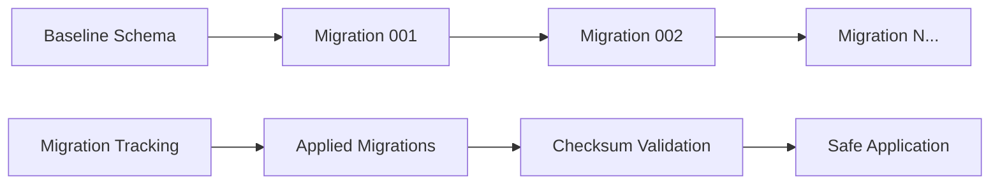

# BMLibrarian Documentation

Welcome to the BMLibrarian documentation! This guide will help you understand and use BMLibrarian's migration system for managing biomedical literature databases.

## Quick Navigation

### For End Users
- **[Getting Started](users/getting_started.md)** - Installation and basic setup
- **[Migration System Guide](users/migration_system.md)** - Complete guide to database migrations
- **[CLI Reference](users/cli_reference.md)** - Command-line interface documentation
- **[Troubleshooting](users/troubleshooting.md)** - Solutions to common problems

### For Developers  
- **[Architecture](developers/architecture.md)** - System design and architecture overview
- **[Contributing](developers/contributing.md)** - Development setup and contribution guidelines
- **[API Reference](developers/api_reference.md)** - Complete API documentation

## What is BMLibrarian?

BMLibrarian is a Python library designed for accessing and managing biomedical literature databases. It provides:

- **Robust Migration System**: Manage database schema changes safely and consistently
- **PostgreSQL Integration**: Built specifically for PostgreSQL with pgvector extension support
- **CLI Tools**: Command-line interface for database management
- **Python API**: Programmatic access for application integration

## Core Features

### 🗄️ Database Migration Management
- Automated schema initialization
- Incremental migration system
- Migration tracking and validation
- Safe rollback capabilities

### 🔧 Developer-Friendly Tools
- Command-line interface for common operations
- Python API for custom integrations
- Comprehensive test suite
- Extensive documentation

### 🛡️ Production-Ready
- Security-conscious design
- Error handling and recovery
- Environment-based configuration
- PostgreSQL best practices

## Getting Started

### Quick Installation

```bash
pip install bmlibrarian
```

### Basic Setup

1. **Install Prerequisites:**
   - PostgreSQL 12+ with pgvector extension
   - Python 3.12+

2. **Configure Environment:**
   ```bash
   export POSTGRES_USER=your_username
   export POSTGRES_PASSWORD=your_password
   export POSTGRES_DB=bmlibrarian_dev
   ```

3. **Initialize Database:**
   ```bash
   bmlibrarian migrate init \
       --host localhost \
       --user your_username \
       --password your_password \
       --database bmlibrarian_dev
   ```

4. **Use in Python:**
   ```python
   import bmlibrarian
   
   # Initialize app and apply migrations
   bmlibrarian.initialize_app()
   
   # Get database connection
   conn = bmlibrarian.get_database_connection()
   ```

## Documentation Structure

### Users Documentation (`doc/users/`)

End-user focused documentation covering:
- Installation and setup procedures
- Command-line interface usage
- Migration management workflows
- Troubleshooting common issues

### Developers Documentation (`doc/developers/`)

Technical documentation for contributors:
- System architecture and design
- API reference and examples
- Development setup and guidelines
- Contributing processes

## Migration System Overview

BMLibrarian's migration system ensures database consistency across environments:



**Key Concepts:**
- **Baseline Schema**: Initial database structure
- **Incremental Migrations**: Sequential schema changes
- **Migration Tracking**: Records applied migrations
- **Checksum Validation**: Prevents unauthorized changes

## Common Use Cases

### 1. New Project Setup
```bash
# Initialize new database
bmlibrarian migrate init --host localhost --user dev --password dev --database myproject_dev
```

### 2. Applying Schema Updates
```bash
# Apply pending migrations
bmlibrarian migrate apply --host localhost --user dev --password dev --database myproject_dev
```

### 3. Application Integration
```python
import bmlibrarian

# Auto-apply migrations on startup
bmlibrarian.initialize_app()

# Application logic with database access
conn = bmlibrarian.get_database_connection()
# ... use connection ...
conn.close()
```

### 4. Custom Migration Management
```python
from bmlibrarian.migrations import MigrationManager
from pathlib import Path

manager = MigrationManager(
    host="prod-db", port="5432",
    user="admin", password="secret",
    database="production"
)

# Apply migrations from custom directory
count = manager.apply_pending_migrations(Path("/opt/custom_migrations"))
print(f"Applied {count} migrations")
```

## Security Considerations

- **Environment Variables**: Store credentials securely
- **Least Privilege**: Use minimal database permissions
- **Network Security**: Use SSL connections in production
- **Code Review**: Review all migrations before application

## Support and Community

### Getting Help
1. Check the [Troubleshooting Guide](users/troubleshooting.md)
2. Review the [API Reference](developers/api_reference.md)
3. Search existing documentation
4. Report issues with detailed information

### Contributing
1. Read the [Contributing Guide](developers/contributing.md)
2. Set up development environment
3. Write tests for new features
4. Update documentation as needed

## What's Next?

- **For New Users**: Start with [Getting Started](users/getting_started.md)
- **For Migration Tasks**: See [Migration System Guide](users/migration_system.md)
- **For CLI Usage**: Check [CLI Reference](users/cli_reference.md)
- **For Development**: Read [Contributing Guide](developers/contributing.md)
- **For API Usage**: Review [API Reference](developers/api_reference.md)

## Version Information

This documentation covers BMLibrarian v0.1.0 and the migration system.

For the latest updates and releases, check the project repository.

---

**Need help?** Check the specific documentation sections or the troubleshooting guide for detailed assistance.