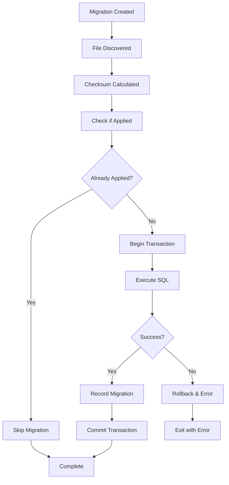

# BMLibrarian Architecture

This document describes the architecture and design principles of the BMLibrarian migration system.

## Overview

BMLibrarian is designed as a modular Python library for biomedical literature database management. The migration system is a core component that ensures database schema consistency across environments and versions.

## System Architecture

```
BMLibrarian
├── Migration System
│   ├── MigrationManager (core logic)
│   ├── CLI Interface (user interaction)
│   └── App Integration (automatic migrations)
├── Database Layer
│   ├── PostgreSQL + pgvector
│   └── Connection Management
└── Future Modules
    ├── Literature Indexing
    ├── Search Engine
    └── API Layer
```

## Core Components

### 1. MigrationManager (`src/bmlibrarian/migrations.py`)

The central class responsible for all migration operations.

**Responsibilities:**
- Database connection management
- Migration discovery and validation
- Schema application and tracking
- Error handling and rollback safety

**Key Methods:**
- `initialize_database()`: Sets up new database with baseline schema
- `apply_pending_migrations()`: Applies unapplied migrations
- `_database_exists()`: Checks database existence
- `_apply_sql_file()`: Executes SQL migration files

**Design Principles:**
- **Idempotent operations**: Safe to run multiple times
- **Atomic transactions**: Each migration is a complete unit
- **Checksum validation**: Prevents modification of applied migrations
- **Ordered execution**: Numeric prefixes ensure proper sequencing

### 2. CLI Interface (`src/bmlibrarian/cli.py`)

Command-line interface for migration management.

**Structure:**
```
bmlibrarian
└── migrate
    ├── init    (initialize database)
    └── apply   (apply migrations)
```

**Features:**
- Argument parsing with validation
- Environment variable integration
- Comprehensive error reporting
- Security-conscious credential handling

### 3. App Integration (`src/bmlibrarian/app.py`)

Provides seamless integration with Python applications.

**Functions:**
- `initialize_app()`: Auto-applies pending migrations on startup
- `get_database_connection()`: Provides configured database connections

**Integration Pattern:**
```python
import bmlibrarian

# Automatically handles migrations
bmlibrarian.initialize_app()

# Ready-to-use database connection
conn = bmlibrarian.get_database_connection()
```

## Database Schema

### Migration Tracking Table

```sql
CREATE TABLE bmlibrarian_migrations (
    id SERIAL PRIMARY KEY,
    filename VARCHAR(255) NOT NULL UNIQUE,
    checksum VARCHAR(64) NOT NULL,
    applied_at TIMESTAMP DEFAULT CURRENT_TIMESTAMP
);
```

**Purpose:**
- Track which migrations have been applied
- Prevent duplicate application
- Maintain application order history
- Detect unauthorized modifications (via checksum)

### Baseline Schema

The baseline schema includes:
- Core biomedical literature tables
- Required PostgreSQL extensions (pgvector, pg_trgm)
- Indexes for performance
- Initial data if needed

## Migration Lifecycle



## Security Model

### Principles

1. **Least Privilege**: Database users should have minimal required permissions
2. **Credential Protection**: No passwords in code or logs
3. **Input Validation**: All user inputs are validated
4. **SQL Injection Prevention**: Use parameterized queries

### Permission Requirements

**For Database Initialization (`migrate init`):**
- `CREATEDB` privilege (to create databases)
- `CREATE` privilege on target database
- `INSERT`, `SELECT` on migration table

**For Migration Application (`migrate apply`):**
- `CREATE` privilege (for schema changes)
- `INSERT`, `SELECT` on migration table
- Specific permissions for migration operations

### Credential Management

**Environment Variables (Recommended):**
```bash
export POSTGRES_USER=username
export POSTGRES_PASSWORD=password
```

**Command Line (Development Only):**
```bash
bmlibrarian migrate init --user username --password password
```

**Future Enhancements:**
- Support for `.pgpass` files
- Integration with credential management systems
- SSL/TLS connection configuration

## Error Handling Strategy

### Categories

1. **Connection Errors**: Database unavailable, wrong credentials
2. **Permission Errors**: Insufficient database privileges
3. **Migration Errors**: SQL syntax errors, constraint violations
4. **File System Errors**: Missing files, permission issues

### Recovery Mechanisms

**Atomic Transactions:**
- Each migration runs in a transaction
- Automatic rollback on failure
- Database state remains consistent

**Idempotent Operations:**
- Safe to retry failed operations
- Use `IF NOT EXISTS` and similar constructs
- Graceful handling of already-applied state

**Detailed Error Messages:**
- Specific error descriptions
- Suggested remediation steps
- Context about what was being attempted

## Testing Strategy

### Unit Tests (`tests/`)

**Coverage Areas:**
- All public methods of MigrationManager
- CLI argument parsing and command execution
- App integration functions
- Error conditions and edge cases

**Testing Approach:**
- Mock database connections for isolation
- Temporary files for filesystem operations
- Comprehensive fixture management
- 98%+ code coverage requirement

**Test Categories:**
```
tests/
├── test_migrations.py    # MigrationManager core logic
├── test_cli.py          # Command-line interface
├── test_app.py          # Application integration
└── conftest.py          # Shared fixtures
```

### Integration Testing

**Database Testing:**
- Real PostgreSQL instances for integration tests
- Test with multiple PostgreSQL versions
- Verify extension compatibility

**End-to-End Testing:**
- Full migration workflows
- CLI command integration
- Error scenario validation

## Performance Considerations

### Migration Performance

**Large Schema Changes:**
- Use `CONCURRENTLY` for index creation
- Batch data modifications
- Consider maintenance windows for major changes

**Connection Management:**
- Connection pooling for high-frequency operations
- Proper connection cleanup
- Timeout configuration

### Scalability

**Migration File Management:**
- Efficient file discovery algorithms
- Checksum caching for large migration sets
- Parallel migration application (future enhancement)

## Extension Points

### Custom Migration Directories

```python
migration_manager.apply_pending_migrations(custom_directory)
```

### Custom Database Configurations

```python
manager = MigrationManager(
    host="custom-host",
    port="5433",
    user="custom-user",
    password="custom-pass",
    database="custom-db"
)
```

### Environment-Specific Configurations

Different configurations for development, testing, and production environments.

## Development Workflow

### Adding New Features

1. **Design**: Document architecture changes
2. **Implementation**: Follow existing patterns
3. **Testing**: Comprehensive unit and integration tests
4. **Documentation**: Update user and developer docs
5. **Review**: Code review process

### Migration Best Practices

**For Developers:**
- Always test migrations on sample data
- Write reversible migrations when possible
- Document complex migration logic
- Use descriptive naming conventions

**Code Review Checklist:**
- [ ] Migration is idempotent
- [ ] Proper error handling
- [ ] Security considerations addressed
- [ ] Tests cover new functionality
- [ ] Documentation updated

## Future Enhancements

### Planned Features

1. **Migration Rollback**: Support for reversing migrations
2. **Parallel Execution**: Concurrent migration application
3. **Advanced Logging**: Structured logging with correlation IDs
4. **Configuration Files**: YAML/TOML configuration support
5. **Migration Templates**: Code generation for common patterns

### Architecture Evolution

**Microservice Support:**
- Service-specific migration directories
- Distributed migration coordination
- Cross-service dependency management

**Cloud Integration:**
- Cloud database service support
- Managed PostgreSQL integration
- Kubernetes deployment patterns

**Monitoring and Observability:**
- Migration performance metrics
- Health check endpoints
- Integration with monitoring systems

## Debugging and Maintenance

### Debugging Tools

**Built-in Diagnostics:**
```python
# Check migration status
manager._get_applied_migrations()

# Verify database connectivity
manager._database_exists("database_name")

# Validate migration files
manager._calculate_checksum(content)
```

**External Tools:**
- PostgreSQL logs for SQL execution details
- Application logs for migration workflow
- Database monitoring for performance analysis

### Maintenance Tasks

**Regular Maintenance:**
- Monitor migration application times
- Review migration file organization
- Update documentation for schema changes
- Backup critical migration files

**Troubleshooting:**
- Check migration table consistency
- Validate file checksums
- Review permission settings
- Analyze connection patterns

This architecture provides a solid foundation for reliable database schema management while maintaining flexibility for future enhancements.