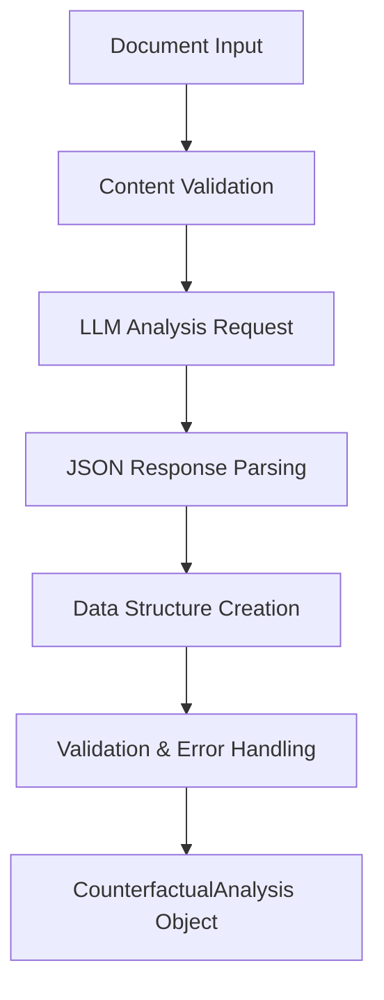

# Counterfactual Checking System - Developer Documentation

## Overview

The CounterfactualAgent is a specialized AI agent that performs systematic critical analysis of documents and research claims. It generates targeted research questions designed to find contradictory evidence, supporting rigorous academic research and evidence validation workflows.

## Architecture

### Core Components

```
CounterfactualAgent (BaseAgent)
├── Document Analysis Engine
├── Claim Extraction System
├── Question Generation Engine
├── Priority Assessment Module
└── Protocol Generation System
```

### Data Structures

#### CounterfactualQuestion
```python
@dataclass
class CounterfactualQuestion:
    question: str                    # The research question
    reasoning: str                   # Why this question matters
    target_claim: str               # Which claim it targets
    search_keywords: List[str]      # Search keywords
    priority: str                   # HIGH/MEDIUM/LOW
    created_at: Optional[datetime]  # Auto-generated timestamp
```

#### CounterfactualAnalysis
```python
@dataclass
class CounterfactualAnalysis:
    document_title: str                              # Document identifier
    main_claims: List[str]                          # Extracted key claims
    counterfactual_questions: List[CounterfactualQuestion]  # Generated questions
    overall_assessment: str                         # Quality assessment
    confidence_level: str                          # HIGH/MEDIUM/LOW confidence
    created_at: Optional[datetime]                 # Auto-generated timestamp
```

## Implementation Details

### System Prompt Design

The agent uses a specialized system prompt that:

1. **Establishes Role**: Defines the agent as a critical thinking expert in biomedical research
2. **Provides Framework**: Gives specific guidelines for generating counterfactual questions
3. **Sets Quality Standards**: Ensures focus on methodological limitations and alternative explanations
4. **Defines Output Format**: Specifies exact JSON structure for consistent parsing

Key prompt sections:
- Scoring methodology for claim importance
- Types of limitations to consider (methodological, population-specific, temporal, etc.)
- Focus areas (causation vs correlation, confounding factors, publication bias)
- Structured JSON response format

### Document Processing Pipeline



### LLM Integration

The agent inherits from BaseAgent and uses:
- **Model**: `gpt-oss:20b` (default for complex reasoning)
- **Temperature**: `0.2` (slightly higher for creative question generation)
- **Token Limit**: 2000 tokens for comprehensive analysis
- **Error Handling**: Robust JSON parsing with field validation

### Question Generation Strategy

The agent generates questions targeting:

1. **Methodological Limitations**
   - Sample size and selection bias
   - Study design weaknesses
   - Measurement validity issues

2. **Generalizability Concerns**
   - Population-specific findings
   - Cultural or geographic limitations
   - Temporal context dependencies

3. **Alternative Explanations**
   - Confounding variables
   - Reverse causation possibilities
   - Mediation vs. direct effects

4. **Effect Size and Significance**
   - Publication bias concerns
   - Clinical vs. statistical significance
   - Dose-response relationships

## API Reference

### Core Methods

#### `analyze_document(document_content: str, document_title: str = "Untitled Document") -> Optional[CounterfactualAnalysis]`

**Purpose**: Analyzes a document to generate counterfactual research questions.

**Parameters**:
- `document_content`: Full text content of the document
- `document_title`: Optional title for identification

**Returns**: `CounterfactualAnalysis` object or `None` if analysis fails

**Error Conditions**:
- Empty or None document content
- Ollama connection failures
- Invalid JSON responses from LLM
- Missing required fields in response

#### `analyze_report_citations(report_content: str, citations: List[Any]) -> Optional[CounterfactualAnalysis]`

**Purpose**: Analyzes a research report along with its supporting citations.

**Parameters**:
- `report_content`: The research report text
- `citations`: List of Citation objects or citation dictionaries

**Returns**: `CounterfactualAnalysis` with questions targeting both report and evidence base

**Implementation Notes**:
- Formats citation information for comprehensive analysis
- Combines report content with citation summaries
- Leverages existing `analyze_document` infrastructure

### Utility Methods

#### `get_high_priority_questions(analysis: CounterfactualAnalysis) -> List[CounterfactualQuestion]`
Filters analysis results to return only HIGH priority questions.

#### `format_questions_for_search(questions: List[CounterfactualQuestion]) -> List[str]`
Converts questions to search-ready query strings using OR logic for keywords.

#### `generate_research_protocol(analysis: CounterfactualAnalysis) -> str`
Creates formatted research protocol with prioritized questions and search guidance.

## Integration Patterns

### With Existing Agent Workflow

```python
# Standard BMLibrarian workflow with counterfactual checking
def complete_research_workflow_with_validation(user_question: str):
    # 1. Standard workflow
    query_agent = QueryAgent()
    scoring_agent = DocumentScoringAgent()
    citation_agent = CitationFinderAgent()
    reporting_agent = ReportingAgent()
    
    # Generate initial report
    documents = query_agent.search_documents(user_question)
    scored_docs = [(doc, scoring_agent.evaluate_document(user_question, doc)) 
                   for doc in documents]
    citations = citation_agent.process_scored_documents_for_citations(
        user_question, scored_docs, score_threshold=3.0
    )
    report = reporting_agent.generate_citation_based_report(user_question, citations)
    
    # 2. Counterfactual analysis
    counterfactual_agent = CounterfactualAgent()
    validation_analysis = counterfactual_agent.analyze_report_citations(report, citations)
    
    # 3. Generate validation protocol
    if validation_analysis:
        protocol = counterfactual_agent.generate_research_protocol(validation_analysis)
        return report, protocol, validation_analysis
    
    return report, None, None
```

### Queue-Based Processing

```python
# Using orchestrator for batch counterfactual analysis
orchestrator = AgentOrchestrator(max_workers=4)
agent = CounterfactualAgent(orchestrator=orchestrator)

# Submit batch analysis tasks
documents = ["doc1_content", "doc2_content", "doc3_content"]
task_data = [{"document_content": doc, "document_title": f"Document {i}"} 
             for i, doc in enumerate(documents)]

task_ids = agent.submit_batch_tasks(
    method_name="analyze_document",
    data_list=task_data,
    priority=TaskPriority.HIGH
)

# Process results as they complete
for task_id in task_ids:
    result = orchestrator.get_task_result(task_id)
    if result:
        analysis = result.get('result')
        # Process counterfactual analysis
```

## Error Handling and Logging

### Error Categories

1. **Input Validation Errors**
   - Empty document content
   - Invalid parameter types

2. **Connection Errors**
   - Ollama service unavailable
   - Network timeouts
   - Model not available

3. **Parsing Errors**
   - Invalid JSON responses
   - Missing required fields
   - Type conversion failures

### Logging Strategy

```python
import logging

logger = logging.getLogger(__name__)

# Key logging points:
logger.error(f"Failed to parse JSON response: {e}")          # JSON parsing failures
logger.error(f"Invalid response structure: {e}")             # Field validation failures  
logger.error(f"Error during counterfactual analysis: {e}")   # General analysis errors
logger.warning(f"Document content is empty or None")         # Input validation warnings
```

### Testing Strategy

#### Unit Tests Coverage

1. **Data Structure Tests**
   - CounterfactualQuestion creation and validation
   - CounterfactualAnalysis initialization
   - Timestamp auto-generation

2. **Core Functionality Tests**
   - Successful document analysis
   - Error handling for various failure modes
   - JSON parsing validation
   - Field validation

3. **Integration Tests**
   - Citation analysis workflow
   - Callback functionality
   - Queue integration

4. **Utility Method Tests**
   - Question filtering
   - Search query formatting
   - Protocol generation

#### Mocking Strategy

```python
@patch('bmlibrarian.agents.counterfactual_agent.CounterfactualAgent._make_ollama_request')
def test_analyze_document_success(mock_request, agent, mock_ollama_response):
    mock_request.return_value = json.dumps(mock_ollama_response)
    result = agent.analyze_document("Test content", "Test Document")
    assert result is not None
```

## Performance Considerations

### Token Usage Optimization

- **System Prompt**: Optimized for clarity without excessive length
- **Response Limit**: 2000 tokens for comprehensive analysis without waste
- **Context Window**: Efficient use of available context for large documents

### Memory Management

- **Streaming**: Not required for analysis responses (finite, structured output)
- **Batch Processing**: Supported through orchestrator integration
- **Cleanup**: Automatic timestamp management, no manual cleanup required

### Scalability Patterns

- **Queue Integration**: Full support for batch processing via orchestrator
- **Connection Pooling**: Inherits from BaseAgent connection management
- **Error Recovery**: Graceful failure handling prevents cascade failures

## Configuration Options

### Model Selection

```python
# For faster processing with simpler documents
agent = CounterfactualAgent(model="medgemma4B_it_q8:latest", temperature=0.3)

# For complex academic papers requiring deep analysis
agent = CounterfactualAgent(model="gpt-oss:20b", temperature=0.1)
```

### Callback Integration

```python
def progress_callback(step: str, data: str):
    print(f"[{step}] {data}")

agent = CounterfactualAgent(callback=progress_callback)

# Callback steps:
# - "counterfactual_analysis": "Analyzing document: {title}"
# - "counterfactual_complete": "Generated {n} research questions"
# - "citation_analysis": "Analyzing report with {n} citations"
```

## Future Enhancement Opportunities

1. **Automated Search Integration**: Direct connection to literature databases using generated queries
2. **Evidence Strength Assessment**: Quantitative scoring of contradictory evidence found
3. **Domain-Specific Templates**: Specialized prompts for different medical specialties
4. **Collaborative Filtering**: Learning from human validation of generated questions
5. **Cross-Reference Analysis**: Automatic detection of conflicting claims across multiple documents

## Contributing

When extending the CounterfactualAgent:

1. **Maintain Data Structure Compatibility**: Preserve existing dataclass fields
2. **Follow Logging Patterns**: Use established logging levels and messages
3. **Add Comprehensive Tests**: Cover new functionality with unit and integration tests
4. **Update Documentation**: Maintain both user and developer documentation
5. **Validate LLM Responses**: Ensure robust parsing of structured responses