# An AI-Augmented Systematic Review System with Complete Audit Trail: Accelerating Evidence Synthesis While Preserving Human Oversight

**Authors:** [Author names to be added]

**Affiliations:** [Affiliations to be added]

**Corresponding Author:** [Contact details to be added]

**Word Count:** [To be calculated]

**Keywords:** systematic review, artificial intelligence, evidence synthesis, machine learning, automation, human-in-the-loop, audit trail, evidence-based medicine

---

## Abstract

**Background:** Systematic reviews are foundational to evidence-based medicine but require substantial time and resources to complete. With an average completion time of 67 weeks and biomedical literature growing at over 3,000 publications daily, the traditional approach to systematic reviews cannot keep pace with the evolving evidence landscape. While artificial intelligence tools have shown promise for automating specific stages of the review process, comprehensive end-to-end systems with complete audit trails remain scarce.

**Objective:** We present BMLibrarian's SystematicReviewAgent, an AI-augmented systematic review system designed to accelerate evidence synthesis while maintaining complete transparency through granular audit trails that exceed the documentation standards of published human reviews.

**Methods:** The system operates on a locally mirrored database containing the complete PubMed archive (36+ million citations) and medRxiv preprint repository, enabling ultra-low latency queries without internet dependency. This infrastructure is essential: our multi-strategy search approach executes 8-12 diverse queries per review, a volume that would be neither feasible nor permissible against external API servers. The system implements an eight-phase workflow integrating multiple specialized AI agents for search planning, literature retrieval, relevance screening, quality assessment, and report generation. Key technical innovations include map-reduce synthesis for context window management, hybrid semantic-keyword search with reciprocal rank fusion, and checkpoint-based human-in-the-loop oversight. We validated the system against published Cochrane systematic reviews, measuring recall of included studies as the primary outcome.

**Results:** [RESULTS SECTION TO BE COMPLETED FOLLOWING BENCHMARK VALIDATION]

**Conclusions:** Our system demonstrates that AI augmentation can substantially accelerate systematic review timelines while providing more granular decision documentation than traditional human reviews. Rather than replacing human reviewers, the system provides researchers with a powerful tool to complete rigorous evidence synthesis in a fraction of the traditional time, freeing them from mechanical tasks to focus on scientific judgment. The complete audit trail for every screening decision—including rejected papers—enables unprecedented peer scrutiny of the review process.

---

## 1. Introduction

### 1.1 The Systematic Review Bottleneck in Evidence-Based Medicine

Systematic reviews represent the gold standard for synthesizing evidence in healthcare, forming the foundation for clinical guidelines, policy decisions, and treatment recommendations (Cochrane Collaboration, 2024). The Cochrane Collaboration, established in 1993, has produced over 6,000 systematic reviews recognized internationally as representing the highest quality in evidence-based healthcare (Cochrane Canada, 2024).

However, the traditional systematic review process demands extraordinary time and resources. A comprehensive analysis by Borah and colleagues found that funded systematic reviews require an average of 42 weeks to complete, with unfunded reviews averaging 26 weeks (Borah et al., 2017). More concerning, recent data from Schmidt and colleagues revealed that the average time from protocol registration to publication has extended to approximately 67 weeks (Schmidt et al., 2020). The Cochrane Handbook acknowledges this challenge, noting that "a well-designed systematic review may take a year or more to complete" and that comprehensive literature searches alone may require 3 to 8 months (Cochrane Training, 2024).

These timelines are incompatible with rapidly evolving medical knowledge. The PubMed database currently contains over 36 million entries, growing by approximately 1.5 million articles annually—a rate exceeding two papers per minute (PMIDigest, 2023). In high-velocity fields like infectious disease, oncology, and pharmacology, a systematic review may be outdated before publication, with critical new evidence emerging during the review period.

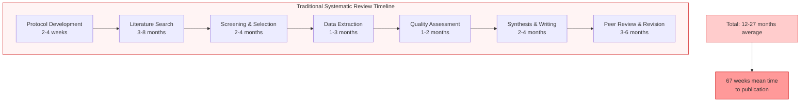

### 1.2 The Scale of the Challenge

The human effort required for systematic reviews is substantial. Cochrane mandates that reviews be undertaken by teams—refusing to publish reviews proposed by single authors—to ensure dual-reviewer screening, data extraction, and quality assessment (Cochrane Training, 2024). Borah and colleagues found that systematic reviews typically involve 5 authors (SD=3), with funded reviews averaging 6.8 team members (Borah et al., 2017).

The screening burden alone can be overwhelming. Depending on the research question, initial searches may retrieve anywhere from 27 to over 92,000 candidate citations (Borah et al., 2017). Each title and abstract must be independently evaluated by at least two reviewers, with disagreements resolved through discussion or a third reviewer. For a review retrieving 5,000 citations—a modest number for broad clinical questions—dual-reviewer screening alone can consume hundreds of person-hours.

This resource intensity creates systematic inequities. Well-funded research institutions can conduct comprehensive reviews, while resource-constrained settings—often where evidence is most needed—cannot maintain the infrastructure for rigorous evidence synthesis. The result is an evidence-based medicine paradigm that struggles to keep pace with medical progress while remaining inaccessible to much of the global health community.

### 1.3 The Promise and Limitations of AI in Evidence Synthesis

Artificial intelligence has shown considerable promise for automating components of the systematic review process. A comprehensive 2024 review in *Artificial Intelligence Review* analyzed 52 papers addressing automation across different review stages: 11 targeting search automation, 33 addressing screening, 6 focusing on data extraction, and 2 on risk of bias assessment (AI Review, 2024). Tools like ASReview utilize machine learning for title and abstract screening, while RobotReviewer applies deep learning for bias assessment (KCL LibGuides, 2024).

Large language models (LLMs) have recently demonstrated particular utility for screening tasks. A 2024 study in the *Journal of Medical Internet Research* found that LLMs can streamline the clinical review process, with models like GPT-4 enhancing efficiency when used as aids rather than replacements for human reviewers (JMIR, 2024).

However, significant gaps remain. Most AI tools address isolated stages of the review process, requiring manual integration and handoffs. Few systems provide comprehensive audit trails documenting decision rationale for each screened citation. Perhaps most critically, existing tools often function as "black boxes," making it difficult for peer reviewers to scrutinize the automated components of the methodology.

### 1.4 Our Contribution

We present BMLibrarian's SystematicReviewAgent, an end-to-end AI-augmented systematic review system designed around three core principles:

1. **Acceleration without replacement:** The system automates mechanical tasks—search execution, initial screening, batch scoring—while preserving human oversight at critical decision points through checkpoint-based approval.

2. **Transparency through comprehensive audit trails:** Every screening decision, including rejections, is documented with explicit rationale, enabling peer scrutiny at granularity exceeding published human reviews.

3. **Validation against gold-standard reviews:** System performance is benchmarked against published Cochrane systematic reviews, ensuring that automation achieves comparable recall of relevant evidence.

The system integrates eight specialized phases spanning search planning through report generation, coordinating multiple AI agents for relevance scoring, quality assessment, PICO extraction, and PRISMA compliance evaluation. Technical innovations include map-reduce synthesis for managing context window limitations, hybrid semantic-keyword search with self-calibrating thresholds, and context-aware filtering to minimize false positive exclusions.

### 1.5 Acknowledgment: AI-Assisted Development

We explicitly acknowledge that this project was developed with substantial assistance from Claude, an AI coding assistant developed by Anthropic. The complete BMLibrarian codebase comprises 379 files containing 159,731 lines (122,184 lines of code), 531 classes, and 4,184 functions—a substantial software system implementing local database infrastructure, multi-agent AI orchestration, graphical user interfaces, and the systematic review workflow described herein.

Without AI-assisted coding, this project would likely have required several additional years of development and may never have achieved the current level of maturity and code quality. This acknowledgment serves dual purposes: transparency about our development process, and demonstration that AI assistants, when used as collaborative tools rather than substitutes for human expertise, can substantially accelerate research software development while maintaining rigorous quality standards. The human-AI collaboration that produced this software mirrors the human-AI collaboration the software enables for systematic reviews.

---

## 2. Methods

### 2.1 Local Literature Database Infrastructure

A fundamental requirement for AI-augmented systematic reviews is the ability to execute numerous exploratory queries rapidly and iteratively. Traditional systematic reviews rely on carefully constructed searches against external databases like PubMed, typically limited to 1-3 well-crafted queries due to API rate limits, manual effort, and the need for reproducible search strategies. Our multi-strategy approach, by contrast, generates and executes 8-12 diverse queries per review to maximize recall—a volume that would be neither technically feasible nor ethically appropriate against public API servers.

BMLibrarian addresses this through complete local mirroring of major biomedical literature databases:

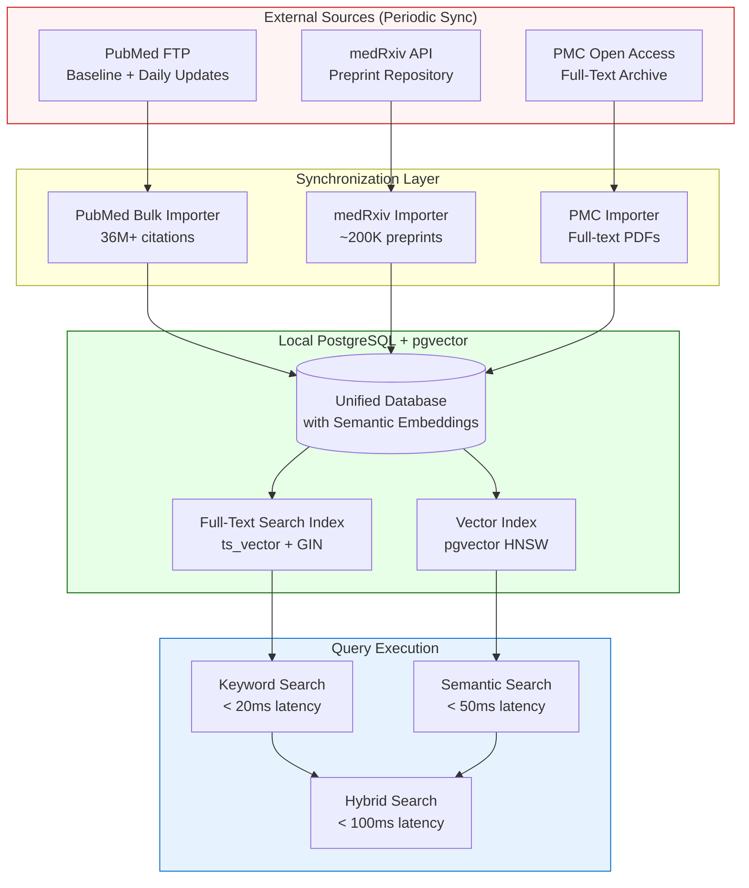

**Database Contents:**
- **PubMed Complete Archive:** 36+ million citations with abstracts, MeSH terms, and full metadata, synchronized via NLM's FTP baseline and daily update files
- **medRxiv Preprints:** Complete repository of biomedical preprints (~200,000+ as of 2024), updated daily
- **PMC Open Access:** Full-text articles from the PubMed Central Open Access subset, with extracted PDFs

**Performance Characteristics:**
- **Semantic search latency:** < 50ms for 36M documents using pgvector HNSW indexing
- **Keyword search latency:** < 20ms using PostgreSQL's GIN-indexed ts_vector
- **Hybrid search latency:** < 100ms combining both approaches
- **No API rate limits:** Unlimited query volume for iterative refinement
- **Offline capability:** Complete functionality without internet after initial sync

This infrastructure enables search strategies that would be impractical with external APIs:
- **Multi-model query generation:** Testing 3+ query formulations per model across multiple models
- **Iterative threshold calibration:** Adjusting relevance thresholds based on result distributions
- **Dynamic query refinement:** Generating additional queries based on initial results
- **Parallel search execution:** Running semantic, keyword, and HyDE queries simultaneously

The periodic synchronization model (daily for medRxiv, weekly for PubMed updates) ensures currency while maintaining the independence from external services required for reproducible, high-volume systematic reviews.

### 2.2 Local Language Model Infrastructure

Complementing the local literature database, BMLibrarian employs locally-executed language models via Ollama, an open-source framework for running LLMs on commodity hardware. This architectural choice prioritizes accessibility, privacy, and operational independence over maximum model capability.

```mermaid
flowchart LR
    subgraph Agents["Multi-Agent System"]
        QA[QueryAgent]
        SA[ScoringAgent]
        CA[CitationAgent]
        RA[ReportingAgent]
        PA[PICOAgent]
        STA[StudyAssessmentAgent]
    end

    subgraph Ollama["Local Ollama Server"]
        M1[General Purpose<br/>7B-120B models]
        M2[Medical Domain<br/>Fine-tuned variants]
        M3[Task-Specific<br/>Custom models]
    end

    subgraph Hardware["Commodity Hardware"]
        GPU[Consumer GPU<br/>16-48GB+ VRAM]
        CPU[CPU Fallback<br/>Slower but functional]
    end

    Agents --> Ollama
    Ollama --> Hardware

    style Agents fill:#e6f3ff,stroke:#0066cc
    style Ollama fill:#e6ffe6,stroke:#006600
    style Hardware fill:#fff0e6,stroke:#cc6600
```

**Model Ecosystem:**

The system is designed to be model-agnostic, supporting any Ollama-compatible model. Different tasks benefit from different model characteristics, and ongoing benchmarking continues to identify optimal configurations. Example models currently in use or under evaluation include:

- **General reasoning models:** GPT-OSS variants (20B for routine tasks, 120B for final report editing and complex synthesis), Qwen family models, Mistral 32B
- **Medical domain models:** MedGemma (4B for fast screening, 27B for detailed assessment), Llama3-Med42-8B, Granite medical variants
- **Task-specific fine-tuning:** Active development includes fine-tuning newer architectures (e.g., OLMo 32B) for systematic review-specific tasks such as inclusion/exclusion classification and quality assessment

The modular architecture allows different models to be assigned to different agents based on task requirements:
- **High-throughput tasks** (initial screening): Smaller, faster models (4B-8B parameters)
- **Complex reasoning tasks** (quality assessment, PICO extraction): Medium models (20B-32B parameters)
- **Final synthesis and editing**: Larger models (70B-120B parameters) where quality justifies longer inference time

**Advantages of Local Execution:**
- **Zero marginal cost:** No per-token API charges enables exploratory analysis and iterative refinement
- **Complete privacy:** Sensitive research questions and institutional data never leave the local network
- **Offline capability:** Full functionality without internet connectivity after initial setup
- **Reproducibility:** Exact model versions can be preserved indefinitely for replication studies
- **No rate limits:** Unlimited throughput constrained only by local hardware
- **Model experimentation:** Freedom to test and benchmark diverse models without cost constraints

**Current Limitations:**
- **Model capability:** Even the largest locally-runnable models lag behind frontier API models (GPT-4, Claude) in reasoning depth
- **Processing speed:** Consumer hardware processes 10-50 tokens/second vs. hundreds for cloud infrastructure
- **Memory constraints:** Model size limited by available VRAM (16GB minimum, 48GB+ for largest models)

**Hardware Requirements:**
- Minimum: 16GB VRAM GPU (e.g., RTX 4080) for models up to 20B parameters
- Recommended: 24-48GB VRAM GPU (e.g., RTX 4090, A6000) for 27B-70B parameter models
- High-end: 80GB+ VRAM (e.g., A100, H100) for 120B+ parameter models
- CPU fallback: Functional but significantly slower (10-20x)

This local-first architecture reflects a deliberate design philosophy: systematic reviews should be accessible to researchers without institutional cloud computing budgets or in settings with limited connectivity. The system demonstrates that meaningful automation is achievable with commodity hardware, while remaining architecturally prepared for cloud LLM integration when circumstances favor that approach.

### 2.4 System Architecture Overview

The SystematicReviewAgent implements a complete systematic review workflow through eight integrated phases, each with configurable parameters and optional human checkpoint approval.

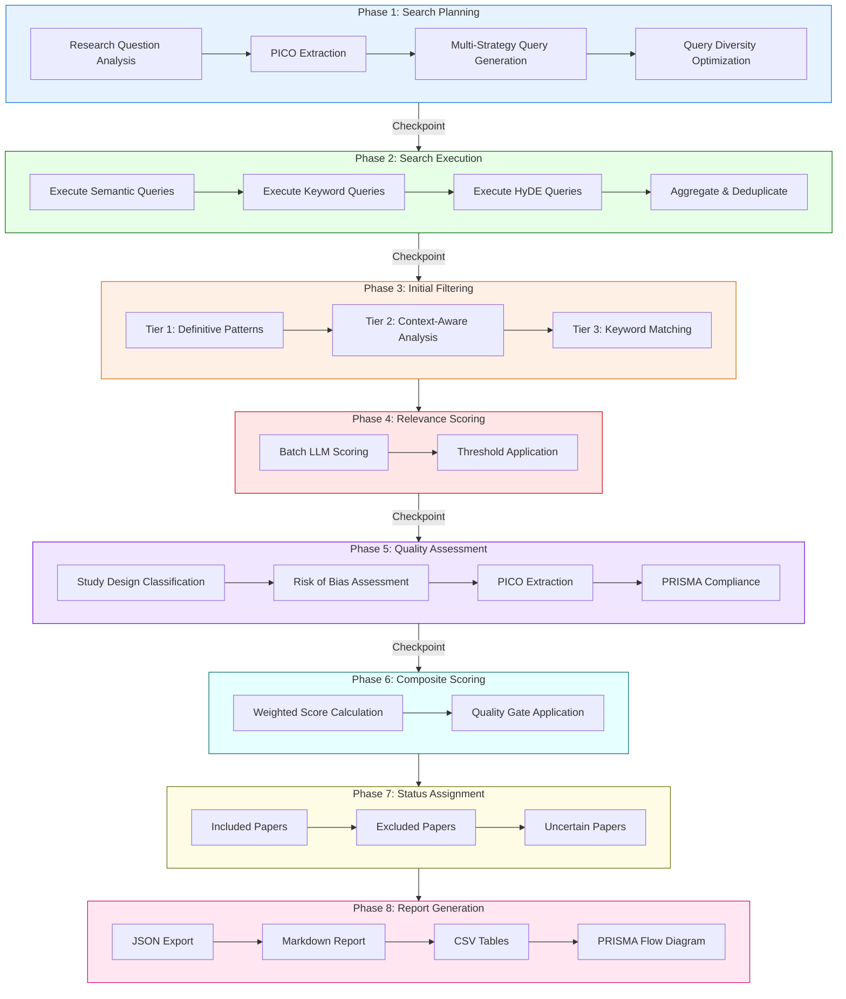

### 2.5 Phase 1: Intelligent Search Planning

The search planning phase converts a natural language research question into a diverse set of database queries optimized for comprehensive retrieval.

#### 2.5.1 PICO Extraction

The system first extracts Population, Intervention, Comparison, and Outcome (PICO) components from the research question using a specialized PICOAgent. This structured representation guides subsequent query generation and enables alignment with Cochrane methodology.

#### 2.5.2 Multi-Strategy Query Generation

Rather than relying on a single query formulation, the system generates multiple complementary queries using different strategies:

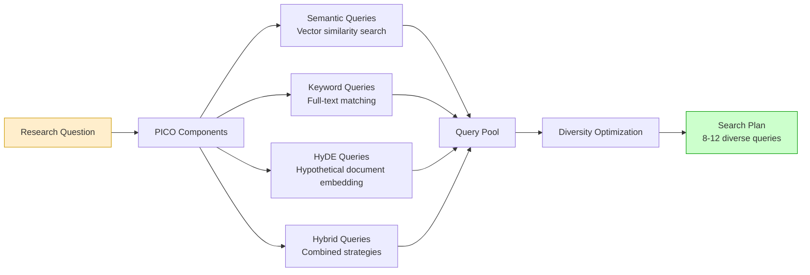

**Hypothetical Document Embedding (HyDE):** For complex research questions, the system generates hypothetical abstracts that would ideally answer the question, then uses these hypothetical documents' embeddings for similarity search. This approach bridges the semantic gap between question-style queries and document-style indexed content.

**Query Diversity Optimization:** The LLM generates query variations using synonym expansion, alternative phrasings, and different emphasis on PICO components, maximizing the probability of retrieving relevant documents that might be missed by any single query formulation.

### 2.6 Phase 2: Search Execution with Hybrid Retrieval

#### 2.6.1 The Hybrid Search Problem

Semantic search using vector embeddings excels at capturing conceptual similarity but struggles with specific numbers, abbreviations, and terminology not well-represented in training data. Keyword search provides precise matching but misses relevant documents using alternative terminology.

Our solution combines both approaches using Reciprocal Rank Fusion (RRF):

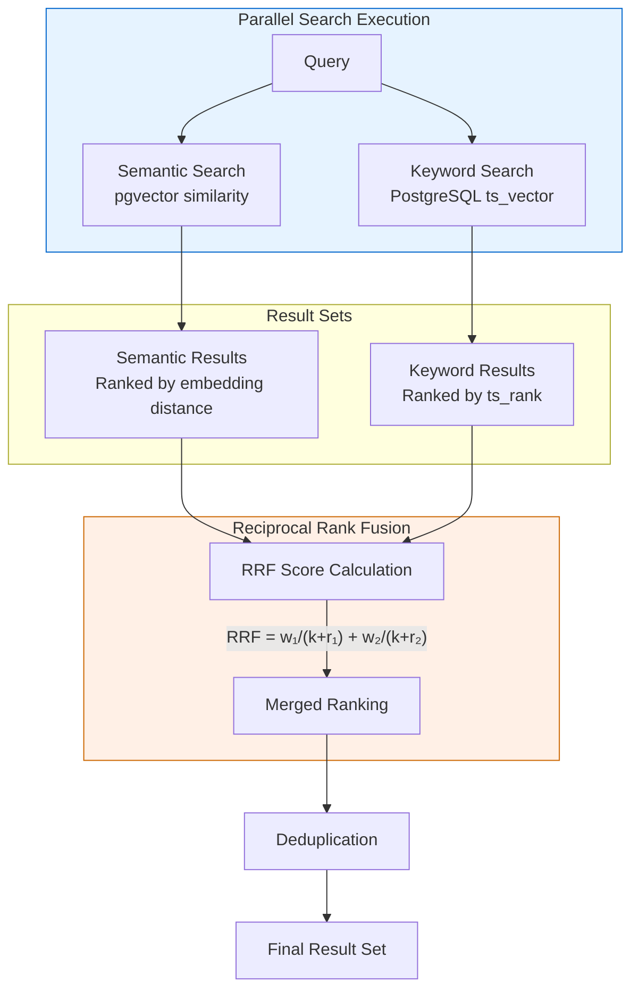

**Reciprocal Rank Fusion Formula:**

$$RRF_{score} = w_s \cdot \frac{1}{k + rank_s} + w_k \cdot \frac{1}{k + rank_k}$$

Where:
- $w_s = 0.6$ (semantic weight)
- $w_k = 0.4$ (keyword weight)
- $k = 60$ (constant, prevents division by small numbers)
- $rank_s$ and $rank_k$ are the document's ranks in each system

This approach uses only rank positions rather than raw scores (which are not comparable across different systems), naturally handling the different score scales of semantic similarity and full-text relevance scoring.

#### 2.6.2 Deduplication and Provenance Tracking

After executing all queries, results are deduplicated while preserving provenance—recording which queries found each paper. This information enables analysis of query effectiveness and supports iterative query refinement.

### 2.7 Phase 3: Context-Aware Initial Filtering

The initial filtering phase rapidly excludes clearly irrelevant papers using heuristic rules before engaging more expensive LLM-based evaluation. However, naive keyword matching produces unacceptable false positive rates (incorrectly excluding relevant papers). Our three-tier approach addresses this:

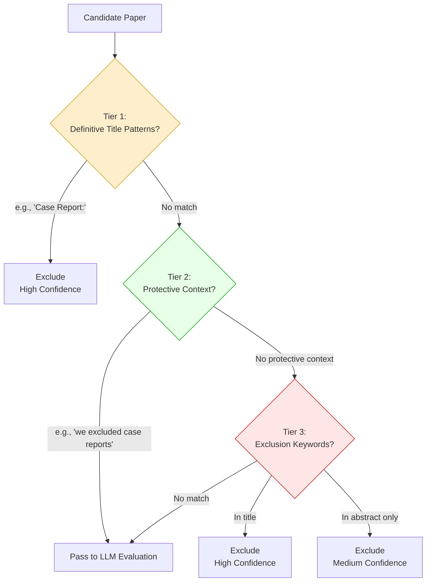

**Tier 1: Definitive Title Patterns**
Pre-compiled regular expressions identify high-confidence exclusion patterns appearing at the start of titles (e.g., "Case Report:", "Editorial:", "In Memoriam:"). These patterns indicate document types that are almost never relevant to systematic reviews of interventional evidence.

**Tier 2: Context-Aware Pattern Detection**
Before excluding based on keywords, the system checks whether the keyword appears in a protective context. For example, a paper stating "we excluded case reports from our analysis" should not itself be excluded for containing "case reports." This prevents the systematic exclusion of methodology papers and systematic reviews that appropriately discuss their exclusion criteria.

**Tier 3: Standard Keyword Matching**
Keywords from explicit exclusion criteria are matched against titles (high confidence) and abstracts (medium confidence). Confidence scores inform downstream processing and audit trail documentation.

### 2.8 Phase 4: LLM-Based Relevance Scoring

Papers passing initial filtering undergo relevance scoring using a specialized DocumentScoringAgent. The system employs batch processing to efficiently evaluate large citation sets:

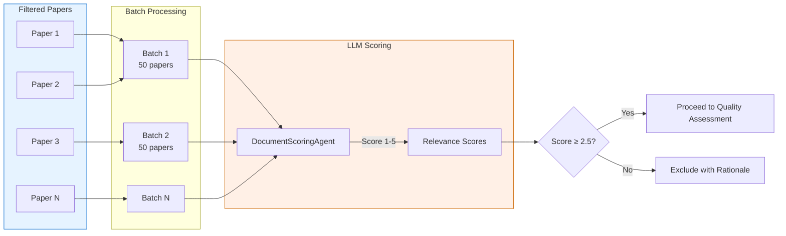

Each paper receives a relevance score from 1 (not relevant) to 5 (highly relevant), along with explicit rationale documenting how the paper relates (or fails to relate) to the research question. Papers scoring below the configurable threshold (default: 2.5) are excluded with documented reasoning.

### 2.9 Phase 5: Multi-Agent Quality Assessment

Quality assessment orchestrates multiple specialized agents, each providing complementary evaluation dimensions:

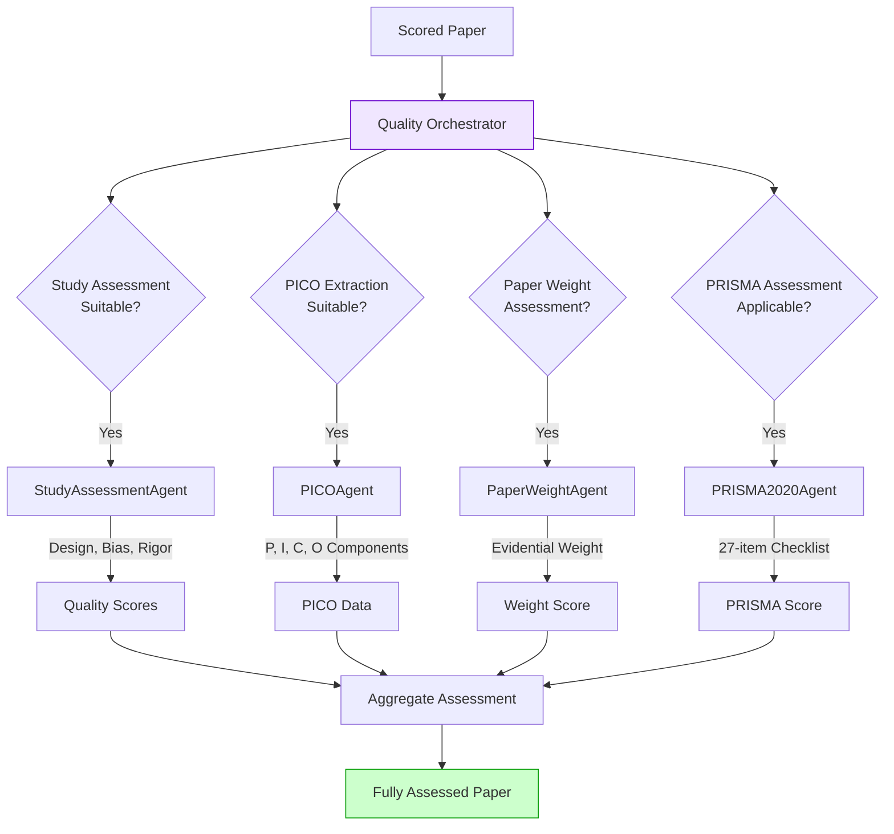

**Suitability-Based Conditional Assessment:** Rather than applying all assessments uniformly, the system uses LLM-based suitability checks to determine which assessments are appropriate for each paper. A randomized controlled trial receives different assessments than an observational cohort study or a meta-analysis. This targeted approach improves both efficiency and accuracy.

**Assessment Components:**

1. **StudyAssessmentAgent:** Evaluates study design classification, risk of bias domains, methodological rigor, sample size adequacy, and confounding variable control.

2. **PaperWeightAssessmentAgent:** Assesses the evidential weight considering statistical power, design strength, generalizability, and consistency with existing evidence.

3. **PICOAgent:** Extracts structured PICO components when applicable, enabling systematic comparison across included studies.

4. **PRISMA2020Agent:** For included systematic reviews and meta-analyses, assesses compliance with the 27-item PRISMA 2020 reporting checklist.

### 2.10 Phase 6: Composite Scoring and Quality Gating

Multiple assessment dimensions are combined into a composite score using configurable weights:

| Dimension | Default Weight | Description |
|-----------|---------------|-------------|
| Relevance | 35% | Direct relevance to research question |
| Study Quality | 25% | Methodological rigor and bias risk |
| Methodology | 20% | Appropriateness of study design |
| Sample Size | 10% | Statistical power adequacy |
| Recency | 5% | Publication date (recent = higher) |
| Replication | 5% | Confirmation by independent studies |

Papers must exceed a configurable quality threshold (default: 4.0/10) to be included. Papers falling below this threshold are excluded with documented composite score breakdown.

### 2.11 Addressing Context Window Limitations: Map-Reduce Synthesis

When generating synthesis reports from large citation sets, direct prompting approaches fail due to LLM context window limitations. Packing 30+ citations into a single prompt causes attention dilution, citation number confusion, and truncated or empty outputs.

Our solution implements a map-reduce pattern with UUID-based reference tracking:

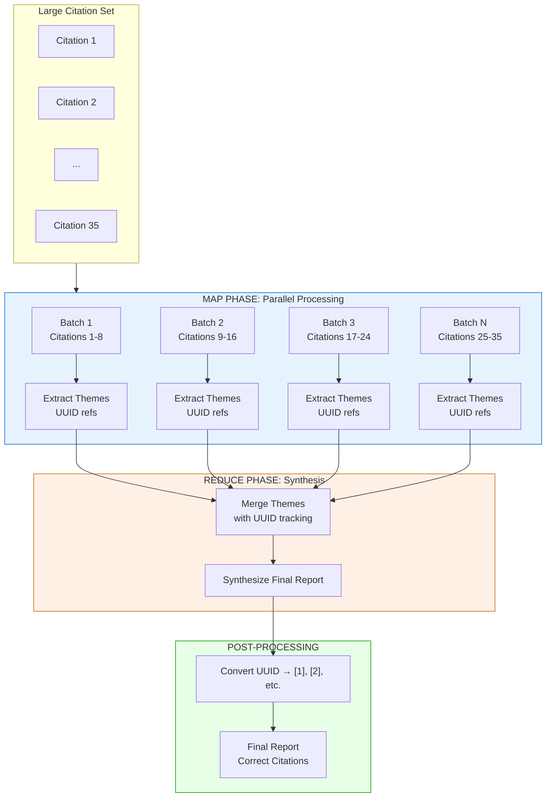

**Why UUID References?**

Sequential citation numbers cause confusion during the reduce phase. If Batch 1 uses [1], [2], [3] and Batch 2 uses [4], [5], [6], the LLM may conflate references during synthesis. UUID references (e.g., `[REF_a7b3c2d1]`) are globally unique and cannot be confused across batches. Post-processing converts these to sequential numbers for the final report.

**Configurable Parameters:**
- Map-reduce threshold: 15 citations (trigger above this count)
- Batch size: 8 citations per batch
- Effective context limit: 6,000 tokens
- Maximum passage length: 500 characters per citation

### 2.12 Audit Trail and Decision Documentation

The Documenter component maintains a comprehensive audit trail exceeding the documentation standards of published systematic reviews:

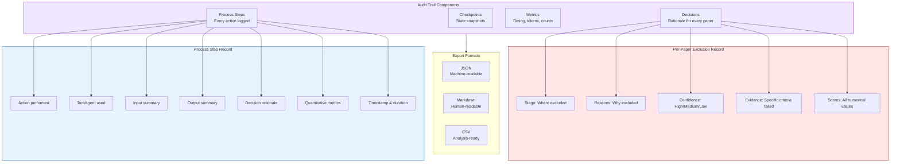

**Key Documentation Features:**

1. **Complete Decision Rationale:** Every paper—whether included, excluded, or marked uncertain—receives documented reasoning explaining the decision.

2. **Exclusion Stage Tracking:** Excluded papers are tagged with the specific stage where exclusion occurred (initial filter, relevance threshold, quality gate), enabling analysis of filtering efficiency.

3. **Reproducibility Information:** The audit trail captures all configuration parameters, random seeds (where applicable), model versions, and execution timestamps.

4. **Peer Scrutiny Enablement:** The granular documentation enables peer reviewers to examine not just included studies (as in traditional reviews) but the decision rationale for every screened citation.

### 2.13 Human-in-the-Loop Implementation

The system implements checkpoint-based human oversight at critical decision points:

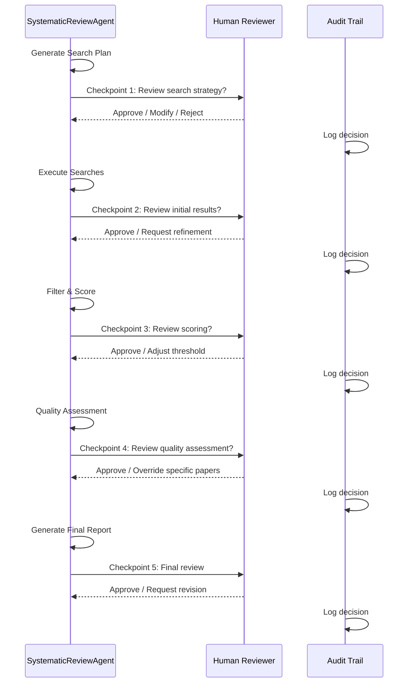

**Checkpoint Capabilities:**

1. **Search Strategy Review:** Examine planned queries before execution, add custom queries, or modify PICO interpretation.

2. **Result Review:** Assess initial retrieval before filtering, identify potential gaps in coverage.

3. **Scoring Review:** Examine relevance score distributions, adjust thresholds if needed.

4. **Quality Assessment Review:** Override individual paper assessments, flag papers for manual review.

5. **Final Review:** Examine complete results before report generation.

Each checkpoint can operate in automatic mode (for batch processing or validation) or interactive mode (for production reviews requiring human judgment).

### 2.14 Benchmark Validation Framework

System performance is validated against published Cochrane systematic reviews:

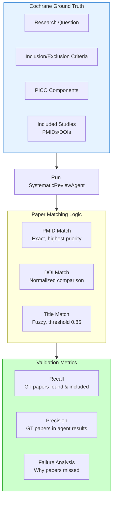

**Primary Validation Metric: 100% Recall**

For the system to be considered valid, every paper included in the Cochrane review must be:
1. Found in our database (by PMID, DOI, or fuzzy title match)
2. Scored as relevant by the agent
3. Included in final results

Papers not found in our database represent database coverage limitations rather than system failures, and are documented separately.

**Benchmark Protocol:**
1. Select published Cochrane reviews with manageable scope (5-15 included studies initially)
2. Extract ground truth: research question, PICO, criteria, and included study identifiers
3. Verify database coverage for ground truth papers
4. Execute SystematicReviewAgent with identical criteria
5. Compute recall, precision, and analyze any failures

---

## 3. Results

*[THIS SECTION TO BE COMPLETED FOLLOWING BENCHMARK VALIDATION]*

### 3.1 Benchmark Performance Against Cochrane Reviews

*[Results of validation against N Cochrane systematic reviews to be inserted]*

**Table 1: Benchmark Results Summary**

| Cochrane ID | Topic | GT Papers | Found | Included | Recall | Precision |
|-------------|-------|-----------|-------|----------|--------|-----------|
| [To be completed] | | | | | | |

### 3.2 Processing Time Analysis

*[Comparison of system processing time vs. traditional review timelines to be inserted]*

**Table 2: Processing Time by Phase**

| Phase | Mean Time | Time Range |
|-------|-----------|------------|
| Search Planning | | |
| Search Execution | | |
| Initial Filtering | | |
| Relevance Scoring | | |
| Quality Assessment | | |
| Report Generation | | |
| **Total** | | |

### 3.3 Filtering Efficiency

*[Analysis of papers excluded at each stage to be inserted]*

### 3.4 Quality Assessment Concordance

*[Comparison of system quality assessments vs. Cochrane reviewer assessments to be inserted]*

### 3.5 Audit Trail Completeness

*[Analysis of documentation coverage and granularity to be inserted]*

---

## 4. Discussion

### 4.1 Principal Findings

*[To be completed following results analysis]*

### 4.2 Accelerating Evidence Synthesis Without Sacrificing Rigor

The traditional systematic review timeline of 12-27 months represents a fundamental barrier to evidence-based medicine's promise of timely clinical guidance. Our system addresses this bottleneck not by replacing human expertise, but by automating the mechanical tasks that consume the majority of reviewer time:

1. **Search execution and deduplication:** Transformed from days of work to minutes of computation.

2. **Initial screening:** Thousands of citations processed in hours rather than weeks of dual-reviewer effort.

3. **Quality assessment:** Parallel evaluation across multiple dimensions without sequential reviewer coordination.

4. **Documentation:** Comprehensive audit trails generated automatically rather than constructed manually.

What remains for human reviewers is the work requiring scientific judgment: refining research questions, interpreting borderline cases, synthesizing findings into clinical recommendations, and validating system decisions at checkpoints.

### 4.3 Transparency Through Comprehensive Audit Trails

Published systematic reviews typically document their methodology at the aggregate level: numbers screened, numbers excluded at each stage, and general exclusion reasons. Individual paper decisions are rarely documented in published reports due to space constraints and the impracticality of manual documentation for thousands of citations.

Our system inverts this limitation, providing documented rationale for every screening decision—including rejected papers. This enables several advances:

1. **Peer review of methodology:** Reviewers can examine not just included studies but the decision logic for exclusions, identifying potential systematic biases in screening.

2. **Reproducibility:** Complete configuration and decision logs enable exact replication of reviews.

3. **Learning from disagreements:** When system decisions differ from expert judgment, the documented rationale enables analysis of where and why disagreements occur.

4. **Methodological research:** Aggregated audit trails across multiple reviews enable research into screening behavior and decision patterns.

### 4.4 Comparison with Existing Automation Tools

Most existing systematic review automation tools address isolated stages of the review process. ASReview provides machine learning-assisted screening but requires manual search execution and quality assessment. RobotReviewer offers bias assessment but not search planning or relevance screening. Our system is distinguished by:

1. **End-to-end integration:** All phases from search planning through report generation in a unified system.

2. **Multi-agent architecture:** Specialized agents for different assessment dimensions, coordinated through intelligent orchestration.

3. **Self-calibrating search:** Hybrid retrieval with automatic threshold adjustment rather than fixed configurations.

4. **Publication-ready outputs:** Generated reports include PRISMA flow diagrams, formatted citations, and structured data exports.

### 4.5 Limitations

Several limitations warrant discussion:

1. **Database coverage:** The system can only find papers indexed in the underlying database. Papers not in PubMed or lacking full-text availability may be missed regardless of system performance.

2. **Local model capability:** The current implementation uses locally-executed models (7B-27B parameters) that, while capable, do not match the reasoning depth of frontier API models like GPT-4 or Claude. Complex edge cases may benefit from more powerful models.

3. **Processing speed:** Local execution on consumer hardware (10-50 tokens/second) is substantially slower than cloud inference. A review processing 1,000 papers may require several hours of computation.

4. **Hardware requirements:** Effective local execution requires consumer GPUs with 16-24GB VRAM—accessible but not universal. CPU-only fallback is functional but impractically slow for production use.

5. **LLM inherent limitations:** All language models can exhibit biases, hallucinations, and inconsistent behavior. Human checkpoint review remains essential regardless of model capability.

6. **Validation scope:** Benchmark validation against Cochrane reviews tests recall of included studies but may not fully capture the nuances of exclusion decisions.

7. **Domain specificity:** The system is optimized for biomedical literature and may require adaptation for other domains.

### 4.6 Future Directions: Cloud LLM Integration

The current local-first architecture represents a deliberate trade-off favoring accessibility, privacy, and zero marginal cost over maximum model capability. However, the system's modular design supports future integration with cloud LLM APIs, offering an alternative deployment model for institutional users:

**Potential Cloud Integration Benefits:**
- **Enhanced reasoning:** Frontier models (GPT-4, Claude, Gemini) offer substantially deeper reasoning for complex inclusion decisions and nuanced quality assessment
- **Faster processing:** Cloud infrastructure typically provides 10-100x faster inference than local execution
- **Reduced hardware requirements:** No local GPU needed; any internet-connected device becomes capable
- **Batch API pricing:** Asynchronous batch APIs offer significant cost reductions for systematic review workloads

**Trade-offs of Cloud Integration:**
- **Per-token costs:** High-volume systematic reviews (processing thousands of papers) incur non-trivial API costs
- **Internet dependency:** Loss of offline capability and vulnerability to network interruptions
- **Privacy considerations:** Research questions and document content transmitted to third-party servers
- **Reproducibility challenges:** Model versions may change over time; exact replication becomes more difficult
- **Rate limiting:** API rate limits may constrain parallel processing strategies

**Hybrid Deployment Model:**

Future implementations may support configurable deployment, allowing users to select based on their constraints:

| Deployment Mode | Speed | Cost | Privacy | Offline | Hardware |
|----------------|-------|------|---------|---------|----------|
| Local (current) | Moderate | Zero | Complete | Yes | GPU required |
| Cloud API | Fast | Per-token | Limited | No | Minimal |
| Hybrid | Variable | Moderate | Partial | Partial | Minimal |

A hybrid model could use local models for high-volume initial screening (where speed matters less) and reserve cloud APIs for complex quality assessments requiring maximum model capability.

The architectural decision to support local models first ensures the system remains accessible to researchers without institutional cloud computing budgets—a population often underserved by existing research automation tools. Cloud integration, when implemented, will provide an optional enhancement rather than a requirement.

### 4.7 Implications for Practice

If our system consistently performs comparably to published Cochrane reviews—achieving 100% recall of included studies with acceptable precision—it could substantially transform evidence synthesis practice:

1. **Democratization:** Research teams without resources for traditional systematic reviews could conduct rigorous evidence synthesis.

2. **Living reviews:** The reduced time burden enables continuous updating as new evidence emerges, keeping reviews current.

3. **Rapid response:** During health emergencies, evidence synthesis could proceed in days rather than years.

4. **Methodological standards:** Comprehensive audit trails could become expected rather than exceptional, raising transparency standards across the field.

### 4.8 The Human-AI Collaboration Model

We emphasize that our system is designed as a tool for human researchers, not a replacement for human judgment. The checkpoint-based architecture explicitly preserves human oversight at critical decisions while automating mechanical tasks.

This collaboration model reflects broader principles about productive human-AI interaction:

1. **AI handles scale:** Processing thousands of citations systematically, consistently, and rapidly.

2. **Humans provide judgment:** Refining criteria, interpreting edge cases, validating automated decisions.

3. **Transparency enables trust:** Comprehensive audit trails allow humans to verify and override AI decisions as needed.

4. **The goal is augmentation:** Freeing researchers from tedium to focus on scientific interpretation.

---

## 5. Conclusions

We present an AI-augmented systematic review system demonstrating that automation can substantially accelerate evidence synthesis while maintaining—and in some respects exceeding—the documentation standards of traditional human reviews. The system provides complete audit trails for every screening decision, enabling peer scrutiny at granularity impossible in manual reviews.

Rather than replacing human reviewers, our system provides researchers with a powerful tool to complete rigorous evidence synthesis in a fraction of the traditional time. If benchmark validation confirms consistent performance comparable to Cochrane reviews, this approach could help address the fundamental tension between the growing volume of biomedical evidence and the resources available for evidence synthesis.

The explicit documentation of AI assistance in both the development of this system and its application to evidence synthesis represents a model for transparent human-AI collaboration in research. When used as collaborative tools supporting human expertise rather than substitutes for human judgment, AI systems can substantially accelerate research progress while maintaining scientific rigor.

*[Final conclusions to be refined following benchmark results]*

---

## 6. Acknowledgments

### AI Coding Assistance

We explicitly acknowledge that the BMLibrarian system was developed with substantial assistance from Claude (Anthropic), an AI coding assistant. The complete codebase comprises:

| Metric | Count |
|--------|-------|
| Total files | 379 |
| Total lines | 159,731 |
| Lines of code | 122,184 |
| Classes | 531 |
| Functions | 4,184 |

This represents a substantial software system implementing local database mirroring for 36+ million PubMed citations, multi-agent AI orchestration, comprehensive GUI applications, and the systematic review workflow described in this paper.

Without AI-assisted development, this project would likely have required several additional years of development and may never have achieved its current level of maturity and code quality. The AI assistant contributed across multiple dimensions:

- **Architecture design:** Multi-agent coordination patterns, queue-based orchestration, plugin systems
- **Algorithm implementation:** Map-reduce synthesis, reciprocal rank fusion, context-aware filtering
- **Infrastructure development:** Database importers, synchronization systems, caching layers
- **Error handling:** Comprehensive exception hierarchies, graceful degradation, retry logic
- **Documentation:** User guides, developer documentation, inline code documentation
- **Testing:** Unit tests, integration tests, benchmark frameworks
- **Code quality:** Type annotations, consistent styling, refactoring suggestions

This acknowledgment serves dual purposes: transparency about our methodology, and demonstration that AI coding assistants, when used as collaborative tools augmenting human expertise rather than replacing it, can substantially accelerate research software development while maintaining rigorous quality standards. The human-AI collaboration that produced BMLibrarian mirrors the human-AI collaboration the software itself enables for systematic reviews.

### Funding

*[Funding sources to be added]*

### Competing Interests

*[Competing interests statement to be added]*

---

## 7. References

1. Borah R, Brown AW, Capers PL, Kaiser KA. Analysis of the time and workers needed to conduct systematic reviews of medical interventions using data from the PROSPERO registry. BMJ Open. 2017;7(2):e012545. doi:10.1136/bmjopen-2016-012545

2. Schmidt L, Olorisade BK, McGuinness LA, Thomas J, Higgins JPT. Data extraction methods for systematic review (semi)automation: A living systematic review. F1000Res. 2020;9:210. doi:10.12688/f1000research.22781.2

3. Cochrane Training. Chapter 1: Starting a review. Cochrane Handbook for Systematic Reviews of Interventions. 2024. https://training.cochrane.org/handbook/current/chapter-01

4. Cochrane Collaboration. Our evidence. 2024. https://www.cochrane.org/evidence

5. Cochrane Canada. Frequently Asked Questions. 2024. https://canada.cochrane.org/frequentlyaskedquestions

6. National Library of Medicine. MEDLINE PubMed Production Statistics. 2024. https://www.nlm.nih.gov/bsd/medline_pubmed_production_stats.html

7. Extance A. How AI technology can tame the scientific literature. Nature. 2018;561:273-274. doi:10.1038/d41586-018-06617-5

8. van de Schoot R, de Bruin J, Schram R, et al. An open source machine learning framework for efficient and transparent systematic reviews. Nat Mach Intell. 2021;3:125-133. doi:10.1038/s42256-020-00287-7

9. Marshall IJ, Kuiper J, Wallace BC. RobotReviewer: evaluation of a system for automatically assessing bias in clinical trials. J Am Med Inform Assoc. 2016;23(1):193-201. doi:10.1093/jamia/ocv044

10. Clark J, Glasziou P, Del Mar C, et al. A full systematic review was completed in 2 weeks using automation tools: a case study. J Clin Epidemiol. 2020;121:81-90. doi:10.1016/j.jclinepi.2020.01.008

11. Tsafnat G, Glasziou P, Choong MK, et al. Systematic review automation technologies. Syst Rev. 2014;3:74. doi:10.1186/2046-4053-3-74

12. *[Additional references to be added]*

---

## Supplementary Materials

### Supplementary Table S1: System Configuration Parameters

| Parameter | Default Value | Description |
|-----------|---------------|-------------|
| `model` | gpt-oss:20b | Primary LLM for analysis |
| `temperature` | 0.2 | LLM sampling temperature |
| `top_p` | 0.9 | Nucleus sampling threshold |
| `max_search_results` | 500 | Maximum papers per query |
| `relevance_threshold` | 2.5 | Minimum relevance score (1-5) |
| `quality_threshold` | 4.0 | Minimum quality score (0-10) |
| `batch_size` | 50 | Papers per LLM batch |
| `map_reduce_threshold` | 15 | Citations triggering map-reduce |
| `map_batch_size` | 8 | Citations per map batch |
| `semantic_weight` | 0.6 | RRF semantic search weight |
| `keyword_weight` | 0.4 | RRF keyword search weight |
| `rrf_k` | 60 | RRF ranking constant |

### Supplementary Figure S1: Complete System Architecture

*[Detailed architecture diagram to be added]*

### Supplementary Table S2: Benchmark Cochrane Reviews

*[Details of Cochrane reviews used for validation to be added]*

### Supplementary Data: Example Audit Trail

*[Anonymized example of complete audit trail output to be added]*

---

*Manuscript prepared for submission to medRxiv*

*Version: Draft 1.0*

*Date: [Current date to be added]*
